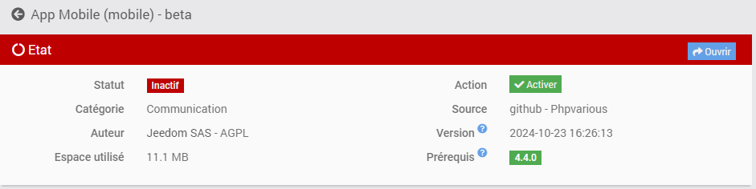
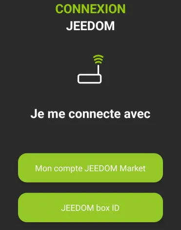
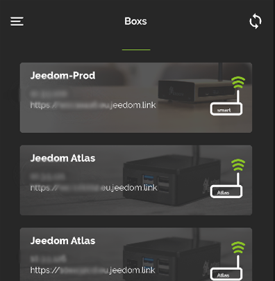

# Plugin Mobile

Plugin permettant d’utiliser l’application Mobile Jeedom.

L’application mobile Jeedom nécessite l’installation de ce plugin afin que la Box puisse dialoguer avec l’application Mobile.

# Configuration du plugin Mobile pour Application V2

Après installation du plugin, il vous suffit de l’activer :

# Première connexion à l'application V2

Pour connecter votre téléphone, il y a 2 méthodes possible.

### **Méthode 1 : CONNEXION VIA LE COMPTE MARKET**

Cette méthode permer de synchroniser, en une seule fois, toutes vos box sur l'application. 
Elle nécessite donc de vous identifier dans un premier temps a votre compte market. 
Il vous faut simplement entrer votre identifiant Market ainsi que votre mot de passe. 
Après avoir cliqué sur "Commencer" vous aurez accès a toutes les box de votre compte Market, et ainsi vous connecter par utilisateur / mot de passe ou par Qrcode. 

### **Méthode 2 : CONNEXION VIA Box ID**

2 choix possible sur cet écran :

#### **Choix 1 :** VIA IDENTIFIANTS

Vous entrez l'url de votre Jeedom (interne ou externe), ainsi que les identifiants d'accès à celle-ci et vous confirmez avec le bouton "Connexion".

#### **Choix 2 :** VIA QRCODE

> **Info**
>
> Via le Qrcode, il vous faudra peut-être donner les droits à Jeedom App d'utiliser la caméra de votre téléphone lorsque celui-ci vous le demandera.

Cliquez sur QR Code, un nouvel écran apparait, scanner le Qrcode depuis le plugin Mobile de la Box que vous souhaitez ajouter, via l'onglet(*) QR Code du plugin.

> (*) Onglet QR Code du plugin Mobile
>
> 

Une fois cette première étape passée, vous êtes enregistré dans l'application: si vous possédez le plugin Mobile, vous aurez accès via le menu aux Notifications, aux QR Codes, la customisation du Menu ....

Dans le menu, vous aurez un onglet Boxs, qui regroupe toutes les Box présentes sur ce compte Market

Il vous suffit de cliquer sur la Box où le plugin Mobile est installé, puis de vous identifier pour accéder à la Box.

La Box passera en haut de la liste, ayant validée son authentification.
Vous pouvez faire ainsi pour plusieurs Boxs.

Vous pouvez aussi cliquer sur le bouton + en bas à droite pour accéder à différentes options;

1) QR Code pour ajouter une Box à la liste via le plugin Mobile,
2) Manuel pour ajouter manuellement une Box
3) Détection Atlas et Luna (si vous êtes en Wifi, détectera les Boxs sur le réseau)
4) Synchronisation Market pour actualiser les informations du compte Market configuré

Pour accéder aux fonctionnalités comme les Notifications, la Personnalisation du Menu ou la Géolocalisation, il faut au préalable avoir sélectionné au moins une Box 'actuelle'

# Fonctionnement de la Géolocalisation

Nous ajoutons une zone de Géolocalisation en cliquant sur l'icône +

Nous tapons l'adresse recherchée, nous validons avec Entrée sur son téléphone; le curseur va alors se positionner sur l'adresse recherchée.
Nous pouvons ensuite ajouter un nom et sauvegarder la zone.

Cela créera une nouvelle commande sur votre équipement mobile, de type binaire, qui correspondra aux entrées et sorties de la zone si la géolocalisation est activée sur votre téléphone mobile.

Nous pouvons également changer le radius de la zone, pour étendre la détection de la zone.

# FAQ

> **J'ai des soucis avec les notifications**
>
> Cette partie est actuellement en cours d'amélioration et d'optimisation sur l'application beta.

> **J'ai des soucis d'affichage de ma webview**
>
> Sur votre Jeedom, dans les Préférences, vérifiez que la page d'accueil du mobile soit bien ACCUEIL.
