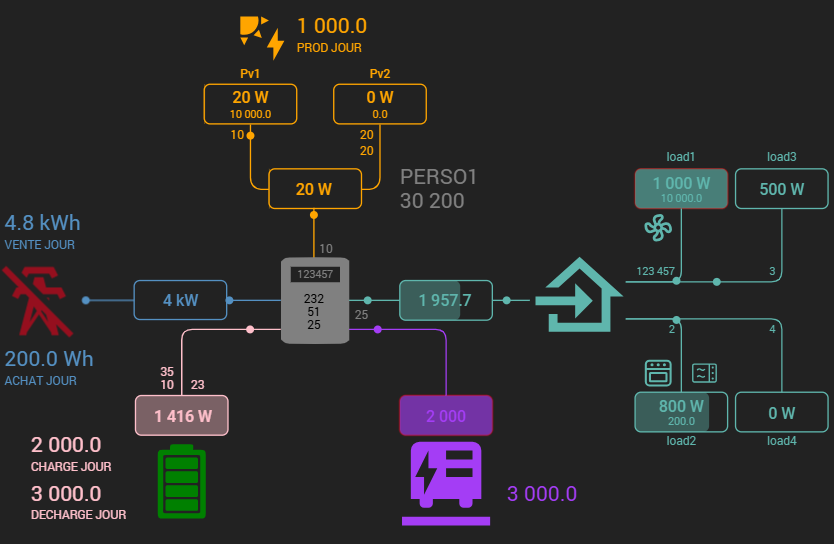

# Plugin powerFlow -green.svg)

# /!\ UNDER CONSTRUCTION /!\ 

This plugin allows you to display a distribution widget (Grid, solar, battery, load and customs elements).

>**IMPORTANT**
>
>The plugin only accepts commands in its configuration. 
>To use variables or calculations, you must first create a virtual and then insert these commands into the plugin.

In the plugin you will find several categories, it is not mandatory to fill in all the fields:
