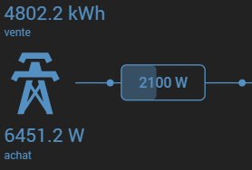

# Plugin powerFlow -green.svg)

# /!\ EN COURS DE CONSTRUCTION /!\ 

Ce plugin permet d'afficher un widget de distribution (Réseau, solaire, batterie, récepteurs et éléments perso).

>**IMPORTANT**
>
>Hormis pour les "max" et "alert" qui autorise l'utilisation d'une variable ou d'une valeur numérique, tous les autres champs accèpte uniquement une commande <i>(#[objet][Equipement][commande]#)</i> 
>Si vous avez besoin de faire un calcul <i>(Ex: récepteur1 + récepteur2)</i>, il faudra avant tout le faire dans un virtuel pour ensuite insérer cette commande dans le plugin.

>**Tips**
>
>Ne pas hésiter a lire les tooltips (<i class="fas fa-question-circle" style="color: #5078aa !important;"></i> <i class="fas fa-exclamation-triangle" style="color: #c37d28 !important;"></i>) présent dans le plugin.

Dans le plugin vous trouvez plusieurs catégories, il n'est pas obligatoire de renseigner tous les champs :

## Onduleur

Commandes possibles :

- Tension. *
- Fréquence. *
- Intensité. *
- LCD. *
- Température AC (alternatif).
- Température DC (continu).

 * En cas d'utilisation d'une image perso, toutes ces infos seront déporté à l'exterieur de l'onduleur dans le widget.

| | |
|--- | ---|
|  Sans image perso |  Avec image perso |

## Réseau

### Puissance instantanée

#### Configuration

##### Couleur

Choisissez la couleur par défaut des éléments "réseau" (bleu par défaut).

#### Puissance
Ajoutez simplement la commande qui contient la puissance instantanée du réseau.

>**Tips**
>
>Par défaut le widget attend une valeur positive pour la consommation et négative pour l'injection. Mais il est possible d'inverser cette valeur en cochant simplement la case "Inverser".

#### Max (en w) :
Indiquez la valeur maximum que peut accepter le réseau. Cette valeur permet de gérer/calculer la gauge en fonction de la puissance instantanée (variable acceptée).

#### Alerte (en w) :
Indiquez la valeur du seuil d'alerte que vous souhaitez. Cette valeur permet, lorsque la consommation instantanée atteind ce seuil, de faire clignoter et de colorer (couleur et clignotement paramètrables dans la config. de l'équipement) le rectangle d'affichage de la consommation (variable acceptée).

### Energie quotidienne

#### Energie vente & Energie achat
Ajoutez simplement les commandes qui contiennent les énergies a afficher.
>**Tips**
>
>Si les énergies sont activées, il existe une interaction de couleurs.  exemple : vous choisissez une couleur orange pour "Energie achat", si vous êtes actuellement en consommation (donc energie achat), le widget affichera toute les infos en rapport au "réseau" en orange.

#### Panne de courant
Si vous disposez d'une commande (binaire) qui permet de connaître l'état du réseau vous pouvez l'indiquer dans cette section. 

# FAQ