# Plugin powerFlow -green.svg)

# ⚠️ EN COURS DE CONSTRUCTION ⚠️


Ce plugin permet d'afficher un widget de distribution (réseau, solaire, batterie, récepteurs et éléments personnalisés).

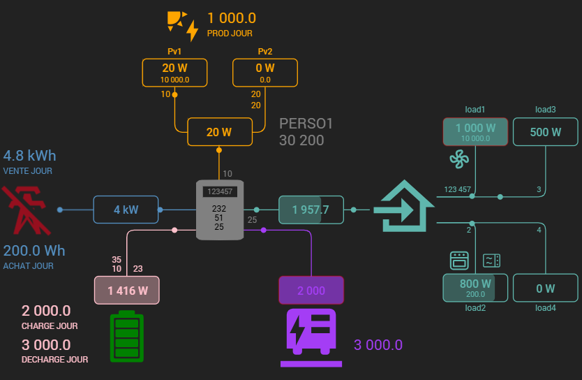


>**Important**
>
>Hormis pour les champs ```Max``` et ```Alerte```, qui autorisent l'utilisation d'une variable ou d'une valeur numérique, tous les autres champs n'accèptent qu'une commande (`#[objet][Equipement][commande]#`)<br>
> Si vous avez besoin d'effectuer un calcul <i>(p.ex. : récepteur 1 + récepteur 2)</i>, il faudra d'abord le faire dans un virtuel, puis insérer la commande résultante dans le plugin.

> **Conseil** : N'hésitez pas à lire les info-bulles (<i class="fas fa-question-circle" style="color: #5078aa !important;"></i> <i class="fas fa-exclamation-triangle" style="color: #c37d28 !important;"></i>) présentent dans le plugin.

>**Information global**<br>
> Tous les champs ```Max``` permettent au plugin d'afficher une gauge en fonction de la puissance instantanée.<br>
> 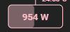<br>
>Tous les champs ```Alerte``` permettent d'indiquer une seuil.<br>
>Lorsque la consommation instantanée atteint ce seuil, le rectangle d'affichage de la consommation clignotera et changera de couleur (couleur et clignotement paramétrables dans la configuration de l'équipement).<br>
>

Dans le plugin, vous trouvez plusieurs catégories, il n'est pas obligatoire de renseigner tous les champs.

## Onduleur

### Configuration onduleur

Choisissez la couleur par défaut des éléments "onduleur" (gris par défaut).<br>
Il est possible de remplacer l'image de l'onduleur par défaut par une icône/image personnalisée, ou même remplacer par un simple cadre en activant la case "Aucun".

### Autres commandes

Commandes possibles :
- Tension. <sup>*</sup>
- Fréquence. <sup>*</sup>
- Intensité. <sup>*</sup>
- LCD.
- Température AC (alternatif).
- Température DC (continu).

 <sup>*</sup> <i> En cas d'utilisation d'une icône/image personnalisée, toutes ces informations seront affichées en dehors de l'onduleur.</i>

| | |
|--- | ---|
| 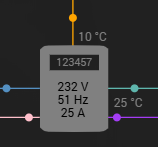<br>Sans image personnalisée | 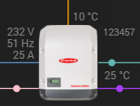<br>Avec image personnalisée |

### Couleur texte intérieur

Vous pouvez choisir la couleur du texte situé a l'interieur de l'onduleur (tension, fréquence et intensité).<br>
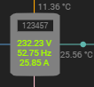

⚠️ Cette couleur sera automatiquement désactivée si vous utilisez une icône/image personnalisée.


## Réseau

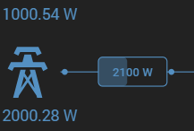

### Configuration des éléments "réseau"

Choisissez la couleur par défaut des éléments "Réseau" (bleu par défaut).

### Puissance réseau instantanée

Ajoutez simplement la commande qui contient la puissance instantanée du réseau.

> *Par défaut le widget attend une valeur positive pour la consommation et négative pour l'injection.*
> *Cependant, il est possible d'inverser cette logique en cochant simplement la case "Inverser".*

### Energie réseau quotidienne

#### Energie vente & Energie achat

Ajoutez simplement les commandes qui contiennent les énergies à afficher.

>**Tips**
>
>Lorsque les énergies sont activées, il existe une interaction de couleurs.<br>
> Par exemple, si vous choisissez une couleur orange pour "Energie achat" et que vous êtes actuellement en consommation, le widget affichera toutes les informations liées au "réseau" en orange.<br>
> 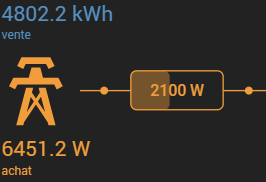<br>

Vous avez la possibilité d'afficher un texte personnalisé (```Texte à afficher```) :<br>
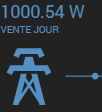<br>
*Exemple : VENTE JOUR*

#### Panne de courant

Si vous disposez d'une commande (binaire) qui permet de connaître l'état du réseau vous pouvez la renseigner afin de le représenter dans le widget, la couleur est aussi personnalisable.<br>
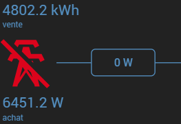


## Solaire

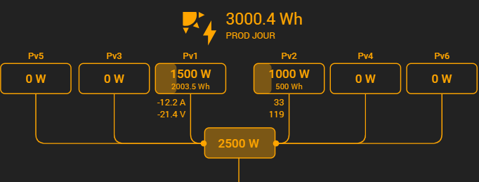

### Configuration des éléments "solaire"

Choisissez la couleur par défaut des éléments "Solaire" (orange par défaut).

### Puissance totale instantanée

Si vous disposez déjà d'une commande contenant la puissance totale des panneaux, vous pouvez la renseigner dans ce champ.<br>
Dans le cas contraire, laissez ce champ vide, le widget fera automatiquement le la somme de tous les panneaux réunis.

### Energie solaire quotidienne

Ajoutez simplement la commande qui contient l'énergie ainsi que le texte a afficher.

### Panneaux solaires

#### Couleur si valeur = 0

Vous pouvez choisir une couleur différente pour permettre une visualisation rapide lorsqu'un panneau ne produit rien.<br>
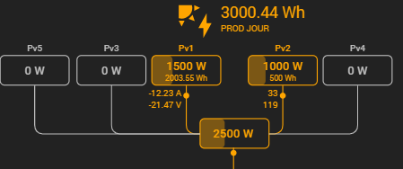<br>
Vous pouvez aussi de ne pas afficher (masquer) le panneau en cochant la case "Masquer si valeur = 0". (prioritaire sur la couleur)<br>
<br>

#### Ajout de panneaux solaires

>**Information**
>
> A partir de 7 panneaux solaires, l'affichage de ceux-ci sur le widget passe en horizontal au dessus des récepteurs.<br>
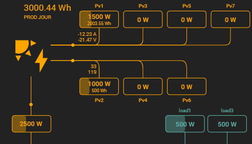<br><br>
*Vous pouvez dans le plugin, réorganiser l'ordre d'affichage en les déplacant verticalement. (drag and drop)*<br>

⚠️Pour chaque panneau ajouté, le champ "Puissance" est obligatoire.<br>

Il est possible d'afficher l'énergie, l'intensité ainsi que la tension pour chaque panneaux (pas obligatoire).

Comme les autres catégories, chaque panneaux disposent d'une gauge et d'un seuil d'alerte. (Max et Alerte en w.)

>**Tips**
>
> Vous pouvez ajouter des panneaux "fantômes", c'est a dire des panneaux qui ne s'afficheront pas mais qui prendront quand même la place prévu dans le widget.<br>Pour cela, ajoutez un panneau, et laissez vide tous les champs.<br>
Exemple pour 5 panneaux sans éléments "fantôme" :<br>
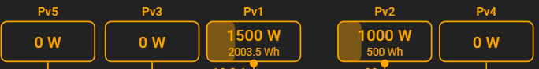<br>
Toujours 5 panneaux, mais avec un élément "fantôme" inséré entre le 2ème et 3ème panneau :<br>
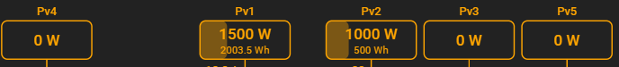<br>

## Batterie


### Configuration des éléments "Batterie"

Choisissez la couleur par défaut des éléments "Batterie" (rose par défaut).

#### Capacité
Indiquez la capacité de la batterie.<br>
Cette valeur permet au widget de calculer et d'afficher la durée restante avant décharge complète ou pleine charge, en fonction du % de batterie restant.<br>
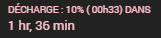

### Puissance instantanée de la batterie
Ajoutez simplement la commande qui contient la puissance instantanée de la batterie.

>**Tips**
>
>Par défaut le widget attend une valeur positive pour la décharge et négative pour la charge.<br>Cependant, il est possible d'inverser cette logique en cochant simplement la case "Inverser".

### Panneau solaire (mppt)
Si vous possèdez un panneau dédié a la batterie, renseignez ces champs pour l'afficher sur le widget :<br>
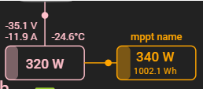<br>

### Energie quotidienne de la batterie
Ajoutez simplement les commandes qui contiennent les énergies à afficher.
>**Tips**
>
>Lorsque les énergies sont activées, il existe aussi une interaction de couleurs dans le widget.<br>voir exemple dans la section "réseau".

### Autres
Permet d'afficher la tension, l'intensité ainsi que la température. (pas obligatoire)

### État de charge

#### État SOC
Choississez la commande qui contient l'état de charge de la batterie en pourcentage.

#### SOC Shutdown. (%)
Choissisez la valeur à laquelle la batterie passe a l'arrêt.<br>
Attention, cette valeur est prise en compte sur le calcul du temps restant avant décharge complète, affiché sur le widget.

#### Icône
Vous pouvez choisir une icône personnalisée pour remplacer de l'icône batterie.<br>
<br>

>**⚠️** Si vous utilisez une icône personnalsée ou une icône intégrée, la gestion des couleurs ci-dessous sera désactivée.<br>

#### Couleurs personnalisées

<span style="display:none;">

#### SOC Min. (%)
Choissisez la valeur à laquelle la batterie est considérée vide.<br>
Attention, cette valeur est prise en compte sur l'affichage de l'icone et la gestion des couleurs.

#### SOC Max. (%)
Choissisez la valeur à laquelle la batterie est considérée pleine.<br>
Attention, cette valeur est prise en compte sur l'affichage de l'icône et la gestion des couleurs.

</span>

Choisissez une couleur personnalisée en fonction du seuil restant de batterie.


# FAQ