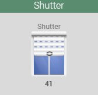
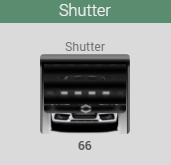
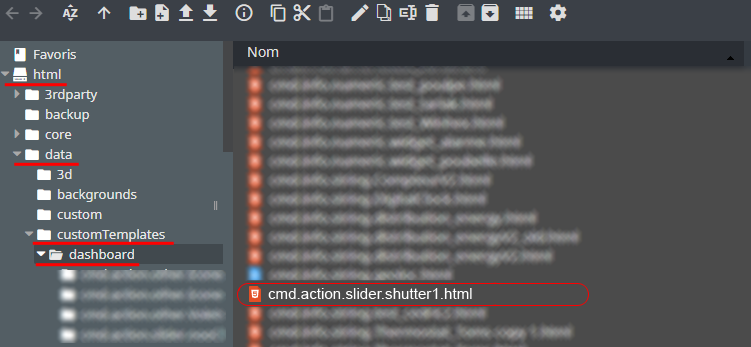
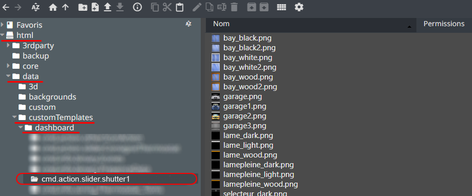

<a href="{{site.url}}/documentation">Accueil</a> --> <a href="{{site.url}}/documentation/{{site.widget}}">Widget</a> --> <a href="{{site.url}}/documentation/{{site.widget}}/fr_FR/action/cursor">Action / Curseur</a> --> cmd.action.slider.shutter1

# Widget [cmd.action.slider.shutter1] 

## Télécharger la source
> - <a href="{{site.url_git}}/WIDGET_cmd.action.slider.shutter1" target="_blank">Télécharger les sources du Widget pour le Core V4</a>

## Version dashboard

- Déposer le fichier <b>cmd.info.numeric.shutter1.html</b> dans le dossier <b>/html/data/customTemplates/dashboard/</b>

  

- Déposer le dossier complet <b>cmd.info.string.shutter1</b> dans le dossier <b>/html/data/customTemplates/dashboard/</b>

  

## Paramètres optionnels

<!--

-->

## Changelog

<a href="./changelog">Changelog</a>

## Aide
> - [Comment récupérer les sources ?]({{site.url}}/documentation/{{site.help}}/fr_FR/download)
> - [Comment ajouter des paramètres ?]({{site.url}}/documentation/{{site.help}}/fr_FR/application)

-------------------

<a href="{{site.url}}/documentation">Accueil</a> --> <a href="{{site.url}}/documentation/{{site.widget}}">Widget</a> --> <a href="{{site.url}}/documentation/{{site.widget}}/fr_FR/action/cursor">Action / Curseur</a> --> cmd.action.slider.shutter1