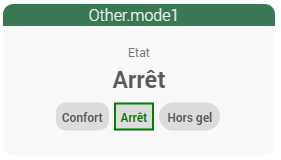
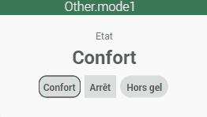
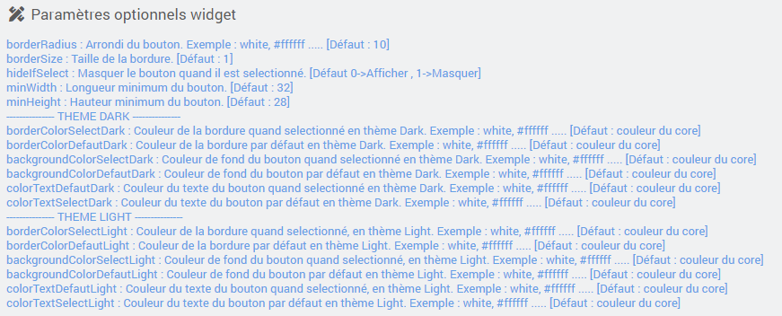

<a href="{{site.url}}/documentation">Accueil</a> --> <a href="{{site.url}}/documentation/{{site.widget}}">Widget</a> --> <a href="{{site.url}}/documentation/{{site.widget}}/fr_FR/action/other">Other</a> --> cmd.action.other.bouton_mode1

# Widget [cmd.action.other.bouton_mode1] 

 

## Télécharger la source
> - [Télécharger les sources du Widget pour le Core V4]({{site.url_git}}/WIDGET_cmd.action.other.bouton_mode1)

## Paramètres optionnels

## Aide
> - [Comment récupérer les sources ?]({{site.url}}/documentation/{{site.help}}/fr_FR/download)
> - [Comment ajouter des paramètres ?]({{site.url}}/documentation/{{site.help}}/fr_FR/application)

<a href="{{site.url}}/documentation">Accueil</a> --> <a href="{{site.url}}/documentation/{{site.widget}}">Widget</a> --> <a href="{{site.url}}/documentation/{{site.widget}}/fr_FR/action/other">Other</a> --> cmd.action.other.bouton_mode1