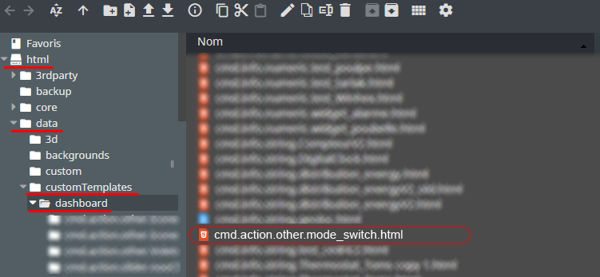
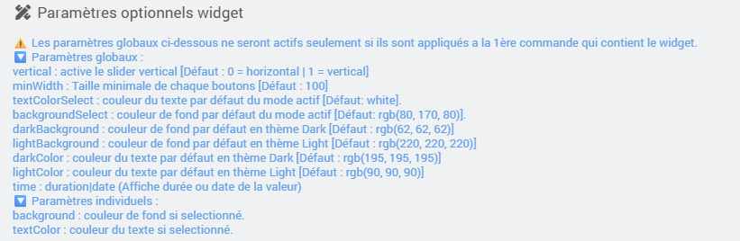

<a href="{{site.url}}/documentation">Accueil</a> --> <a href="{{site.url}}/documentation/{{site.widget}}">Widget</a> --> <a href="{{site.url}}/documentation/{{site.widget}}/fr_FR/action/default">Défaut</a> --> cmd.action.other.mode_switch

# Widget [cmd.action.other.mode_switch] 

   

 

<i class="fas fa-exclamation-circle"></i> <strong>info : </strong> Ce widget est a appliquer sur chaque commande du plugin mode. Dans le cas d'une utilisation dans un virtuel, ne pas oublier de lier chaques commandes action a la commande info et d'appliquer le widget sur chaque commande action.

## Télécharger la source
> - <a href="{{site.url_git}}/WIDGET_cmd.action.other.mode_switch" target="_blank">Télécharger les sources du Widget pour le Core V4</a>

## Version dashboard

Déposer le fichier <b>cmd.action.other.mode_switch.html</b> dans le dossier <b>/html/data/customTemplates/dashboard/</b>

  

## Paramètres optionnels

## Changelog

<a href="./changelog">Changelog</a>

## Aide
> - [Comment récupérer les sources ?]({{site.url}}/documentation/{{site.help}}/fr_FR/download)
> - [Comment ajouter des paramètres ?]({{site.url}}/documentation/{{site.help}}/fr_FR/application)

<a href="{{site.url}}/documentation">Accueil</a> --> <a href="{{site.url}}/documentation/{{site.widget}}">Widget</a> --> <a href="{{site.url}}/documentation/{{site.widget}}/fr_FR/action/default">Défaut</a> --> cmd.action.other.mode_switch