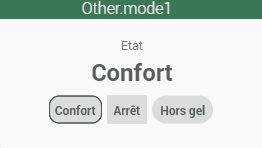
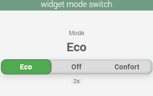
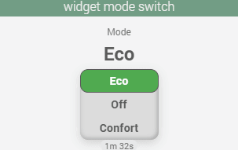

<a href="{{site.url}}/documentation">Accueil</a> --> <a href="{{site.url}}/documentation/{{site.widget}}">Widget</a> --> Défaut

# Widget Action Défaut

| Nom du Widget  | Visuel         | Docs/Téléchargement     | Compatibilité     |
|----------------|----------------|-------------------------|-------------------|
| Homekit1 |   | <a href="./cmd.action.other.homekit1"><i class="fas fa-file-download"></i> Lien</a> |  |
| Bouton_mode1 |  | <a href="./cmd.action.other.bouton_mode1"><i class="fas fa-file-download"></i> Lien</a> |  |
| mode_switch |   | <a href="./cmd.action.other.mode_switch"><i class="fas fa-file-download"></i> Lien</a> |  |

