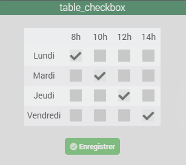
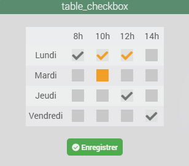
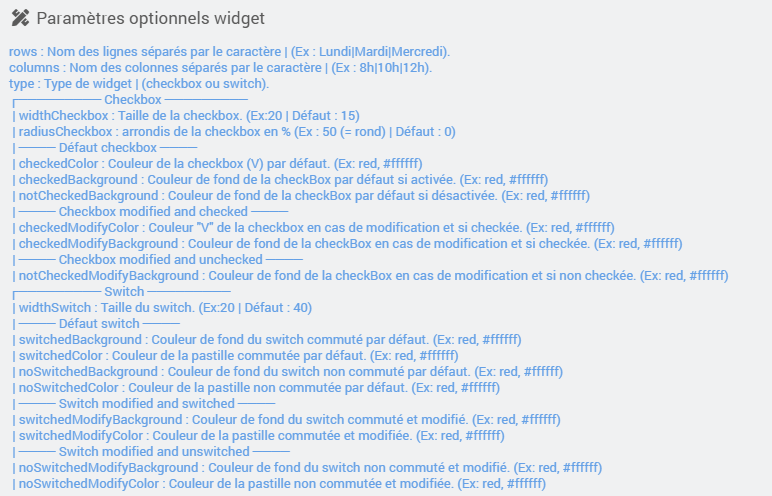
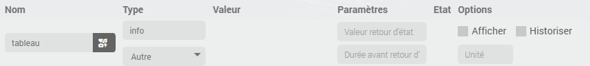
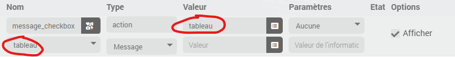
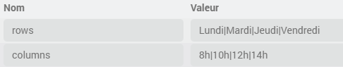
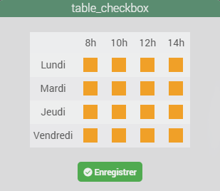
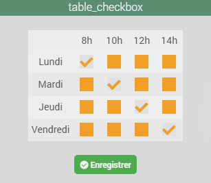
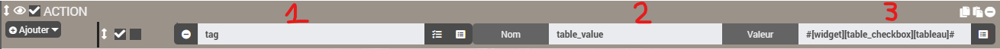
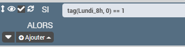

<a href="{{site.url}}/documentation">Accueil</a> --> <a href="{{site.url}}/documentation/{{site.widget}}">Widget</a> --> <a href="{{site.url}}/documentation/{{site.widget}}/fr_FR/action/message">Message</a> --> cmd.action.message.table_checkbox

# Widget [cmd.action.message.table_checkbox] 


 

## Télécharger la source
> - [Télécharger les sources du Widget pour le Core V4]({{site.url_git}}/WIDGET_cmd.action.message.table_checkbox)


## Paramètres optionnels



## Utilisation
### Création d'un virtuel
  - Ajout d'une commande (tableau) info/Autre (ne pas historiser et peut être masqué).

  - Ajout d'une commande (message_checkbox) action/Message lié a la commande info/Autre (tableau)

  - Dans la configuration de la commande action/Message appliquer le widget table_checkbox précedement téléchargé.
  
  - Ensuite il faudra ajouter 2 paramètres optionnels `rows` et `columns`, <br>pour notre exemple : <br>
  <b>en ligne</b> -> Lundi Mardi Jeudi et Vendredi<br>
  <b>en colonne</b> -> 8h 10h 12h et 14h<br>
  Il faudra donc ajouter ces paramêtres :
  

### Affichage

Au 1er affichage, vu qu’il n’y a encore eu aucune sauvegarde, toutes les checkbox sont vides et oranges, et la case Enregistrer est active :



Il suffit simplement d’activer les checkbox souhaitées :



Une fois enregistré, les checkbox reprendrons la couleur par défaut :


> - en résumé, quand une case est orange, c’est qu’il y a eu modification d’une checkbox, et qu’il est nécessaire de sauvegarder.

### Scenario
Le scénario est assez simple, il mettra a disposition des tag contenant la valeur de la checkbox (0 ou 1), il est possible de voir les tag créés dans les log.
Il n’y a pas besoin de modifier ce scénario, même si il y a ajout/modification des paramètres `rows` et `columns` du widget.

- Créer un nouveau scénario.
- Ajouter une action de type `tag` (1), avec le nom `table_value` (2) bien respecter le nom pour le bon fonctionnement du scénario, ensuite dans valeur (3) allez chercher la commande info/Autre (tableau) du virtuel.


- Ajouter un bloc de type `code` et copier/coller le code ci-dessous :

```
$tags = $scenario->getTags();
$json = json_decode($tags['#table_value#'], true); // decodage du tag table_value
if(!is_array($json)) {
  $scenario->setLog('tag table_value mal formatté ou vide');
} else {
  foreach ($json as $row => $column) {
    foreach ($column as $key => $value) {
      $scenario->setLog('tag(' . $row . '_'. $key . ') = ' . $value);
      $tags['#' . $row . '_'. $key . '#'] = $value;
    }
  }
  $scenario->setTags($tags);
}
```
A ce stade après avoir sauvegardé, vous pouvez executer celui-ci.<br>
Pour notre exemple, il en sortira les tags suivant :

```
[2026-01-03 19:43:30][SCENARIO] tag(Lundi_8h) = 1
[2026-01-03 19:43:30][SCENARIO] tag(Lundi_10h) = 0
[2026-01-03 19:43:30][SCENARIO] tag(Lundi_12h) = 0
[2026-01-03 19:43:30][SCENARIO] tag(Lundi_14h) = 0
[2026-01-03 19:43:30][SCENARIO] tag(Mardi_8h) = 0
[2026-01-03 19:43:30][SCENARIO] tag(Mardi_10h) = 1
[2026-01-03 19:43:30][SCENARIO] tag(Mardi_12h) = 0
[2026-01-03 19:43:30][SCENARIO] tag(Mardi_14h) = 0
[2026-01-03 19:43:30][SCENARIO] tag(Jeudi_8h) = 0
[2026-01-03 19:43:30][SCENARIO] tag(Jeudi_10h) = 0
[2026-01-03 19:43:30][SCENARIO] tag(Jeudi_12h) = 1
[2026-01-03 19:43:30][SCENARIO] tag(Jeudi_14h) = 0
[2026-01-03 19:43:30][SCENARIO] tag(Vendredi_8h) = 0
[2026-01-03 19:43:30][SCENARIO] tag(Vendredi_10h) = 0
[2026-01-03 19:43:30][SCENARIO] tag(Vendredi_12h) = 0
[2026-01-03 19:43:30][SCENARIO] tag(Vendredi_14h) = 1
```
Plus qu'a ajouter nos conditions, exemple de vérification si la checkbox du lundi à 8h est checkée :



## Aide
> - [Comment récupérer les sources ?]({{site.url}}/documentation/{{site.help}}/fr_FR/download)
> - [Comment ajouter des paramètres ?]({{site.url}}/documentation/{{site.help}}/fr_FR/application)

<hr />

<a href="{{site.url}}/documentation">Accueil</a> --> <a href="{{site.url}}/documentation/{{site.widget}}">Widget</a> --> <a href="{{site.url}}/documentation/{{site.widget}}/fr_FR/action/message">Message</a> --> cmd.action.message.table_checkbox