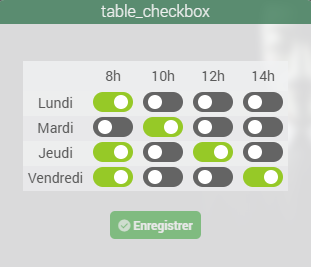

<a href="{{site.url}}/documentation">Accueil</a> --> <a href="{{site.url}}/documentation/{{site.widget}}">Widget</a> --> Message

# Widget Action Message

Nom du Widget | Visuel | Docs/Téléchargement | Compatibilité
|----------------|----------------|-------------------------|-------------------|
| cmd.action.message.table_checkbox |   | <a href="./cmd.action.message.table_checkbox"><i class="fas fa-file-download"></i> Lien</a> |  |