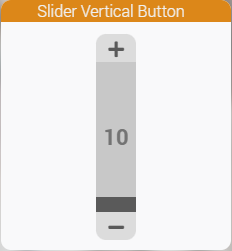
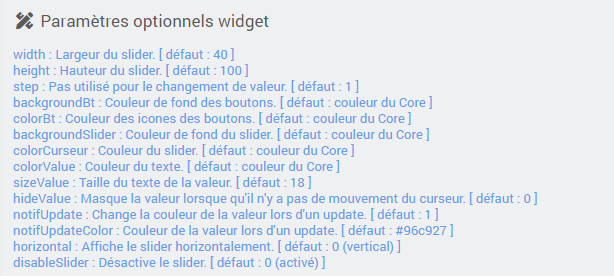

<a href="{{site.url}}/documentation">Accueil</a> --> <a href="{{site.url}}/documentation/{{site.widget}}">Widget</a> --> <a href="{{site.url}}/documentation/{{site.widget}}/fr_FR/action/slider">Slider</a> --> cmd.action.slider.vertical_button_v1

# Widget [cmd.action.slider.vertical_button_v1] 

> **Information**
>
> - Testé seulement en 4.3.20.
>

## Télécharger la source
> - [Télécharger les sources du Widget pour le Core V4]({{site.url_git}}/WIDGET_cmd.action.slider.vertical_button_v1)

## Paramètres optionnels

# Journal des modifications

## 2023
### 15/12/2023 (22h25)
- Création
### 20/12/2023 (19h40)
- Possibilité de passer le slider en horizontal.
- Possibilité de désactiver le slider.

## Aide
> - [Comment récupérer les sources ?]({{site.url}}/documentation/{{site.help}}/fr_FR/download)
> - [Comment ajouter des paramètres ?]({{site.url}}/documentation/{{site.help}}/fr_FR/application)

<a href="{{site.url}}/documentation">Accueil</a> --> <a href="{{site.url}}/documentation/{{site.widget}}">Widget</a> --> <a href="{{site.url}}/documentation/{{site.widget}}/fr_FR/action/slider">Slider</a> --> cmd.action.slider.vertical_button_v1