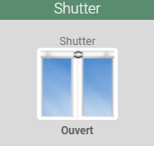
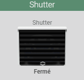
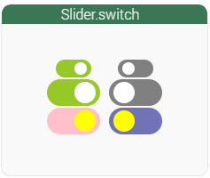
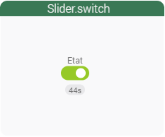
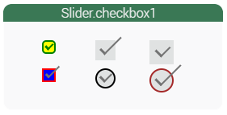
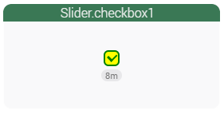
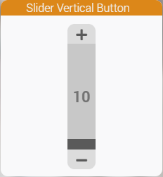
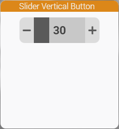

<a href="{{site.url}}/documentation">Accueil</a> --> <a href="{{site.url}}/documentation/{{site.widget}}">Widget</a> --> Curseur

# Widget Action Curseur

| Nom du Widget  | Visuel         | Docs/Téléchargement     | Compatibilité     |
|----------------|----------------|-------------------------|-------------------|
| cmd.action.slider.shutter1 |   | <a href="{{site.url}}/documentation/{{site.widget}}/fr_FR/action/slider/cmd.action.slider.shutter1"><i class="fas fa-file-download"></i> Lien</a> |  |
cmd.action.slider.Widget_Switch1 |   | <a href="./cmd.action.slider.Widget_Switch1"><i class="fas fa-file-download"></i> Lien</a> |  |
| cmd.action.slider.Widget_Checkbox1 |   | <a href="./cmd.action.slider.Widget_Checkbox1"><i class="fas fa-file-download"></i> Lien</a> |  |
| cmd.action.slider.vertical_button_v1 |  | <a href="./cmd.action.slider.vertical_button_v1"><i class="fas fa-file-download"></i> Lien</a> |  |