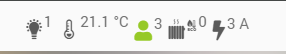
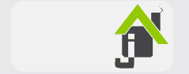

<a href="{{site.url}}/documentation">Accueil</a> --> Custom CSS pour v4.4

------------

# Custom CSS V4.4

<div class="alert alert-info"><i class="fa-solid fa-triangle-exclamation"></i> <strong>Attention : </strong> L’utilisation de règles CSS inappropriées peu casser l’affichage de votre Jeedom.</div>

## Tuiles

### Titre des tuiles sur 2 lignes :

<center></center>

```
/* titres des tuiles sur 2 lignes */
div.eqLogic.eqLogic-widget .widget-name, div.scenario-widget .widget-name {
  max-height: 45px;
  min-height: 24px;
  text-overflow: unset;
  white-space: unset;
  height: unset;
}
```

### Ajouter un saut de ligne (espace) entre 2 commandes :
> **Fonctionnement**
>
> Pour que ce code fonctionne il faut :
> - ajouter un saut de ligne après le widget.
> - et sur l'autre commande ajouter saut de ligne avant le widget.

```
/* Ajouter un saut de ligne (espace) entre 2 commandes */
div.eqLogic-widget div.break + div.break {
  height: 10px !important;
}
```

### Masquer la lettre (d, m ...) sur le graph d'un équipement :

```
/* Masquer la lettre (d, m ...) sur le graph d'un équipement */
.eqLogicGraphPeriod {
  opacity: 0;
}
```

### Rendre transparent le fond des graph des équipements :

```
/* Rendre transparent le fond des graph des équipements */
.eqlogicbackgraph .highcharts-container .highcharts-root .highcharts-series.highcharts-series-0.highcharts-areaspline-series path.highcharts-area {
  fill: transparent;
}
```

### Ajouter une marge en haut des tuiles :

```
/* Ajouter une marge en haut des tuiles */
.eqLogic.eqLogic-widget > .widget-name {
  margin-bottom: 5px;
}
```

### Masque le point présent lors du survol d'une commande action et info historisé

```
/* Masque le point présent lors du survol d'une commande action et info historisé
.eqLogic-widget.eqSignalInfo:after, .eqLogic-widget.eqSignalAction:after {
  content: none;
}
```

## Dashboard

### Ajouter un espace après le nom de l'objet

```
/* Ajouter un espace après le nom de l'objet */
.div_object legend .objectDashLegend {
  margin-bottom: 5px;
}
```

### Rendre fixe de la barre de recherche :

```
/* rendre fixe de la barre de recherche */
#dashTopBar {
    position: fixed;
    top: 46px;
    z-index: 500;
    width: calc(100% - 27px) !important;
    left: 7px;
}
#div_displayObject .row > div:not(.hideByObjectSel) :first-child legend {
  margin-top: 37px !important;
}
[data-page="dashboard"] #dashOverviewPrev.overview {
  margin-top: 32px;
}
```
### Aligner les noms des objets à gauche sur le Dashboard
```
/* Aligner les noms des objets à gauche sur le Dashboard */
.div_object legend {
    text-align: left !important;
}
```

## Vues

### Aligner titres a gauche :

```
/* Aligner titres a gauche sur les vues */
div.div_viewZone legend.lg_viewZone {
  text-align: left !important;
}
```

## UI

### Taille texte dans le Résumé global

<center></center>

```
/* Taille texte dans le Résumé global */
#summaryGlobalMain {
  font-size: 20px;
}
```

### Masquage du lien "synthèse" du menu :
```
/* Masquage du lien "synthèse" du menu */
#jeedomMenuBar > div > nav > ul:nth-child(1) > li:nth-child(1) > ul > li:nth-child(1) {
  display: none;
}
```
### Supprime l'animation (loading) lors du chargement d'une page :
```
/* Supprime l'animation (loading) lors du chargement d'une page  */
#div_jeedomLoading .loadingSpinner {
  display: none;
}
```
### Changement du loading (Effet 1)

<center></center>

```
/* Changement du loading (Effet 1) */
#div_jeedomLoading .loadingSpinner {
  position: relative;
  left: calc(50% - 102px);
  border-radius: 16px;
  width: 205px;
  height: 90px;
  padding: 4px;
  background: rgba(255, 255, 255, 0.4);
  border-top: unset; 
  -webkit-animation: unset;
  animation: unset;
}
#div_jeedomLoading .loadingSpinner:before {
  content: "";
  position: absolute;
  border-radius: 16px;
  width: 82px;
  height: 82px;
  left: 0;
  background: #FFF;
  background: var(--logo-primary-color);
  background: no-repeat center / 100% url(../../core/img/jeedom_home_Light.png);
  -webkit-animation: push_loadingSpinner1 1s infinite ease-in-out;
  animation: push_loadingSpinner1 1s infinite ease-in-out;
  border-top-color: unset;
  top: unset;
  bottom: unset;
  right: unset;
  border: unset;
}
#div_jeedomLoading .loadingSpinner:after { content: none; }
@keyframes push_loadingSpinner1 {
  50% {
    left: 120px;
  }
}
```

### Changement du loading (Effet 2)

<center></center>

```
#div_jeedomLoading .loadingSpinner {
  content: "";
  display: inline-block;
  width: 0;
  height: 0;
  border: solid 30px;
  border-radius: 5em;
  border-color: #0099ff transparent #0099ff transparent;
  animation: spin 1s linear infinite;
}
#div_jeedomLoading .loadingSpinner:after, #div_jeedomLoading2 .loadingSpinner:after {
 content: none;
}
#div_jeedomLoading .loadingSpinner:before, #div_jeedomLoading2 .loadingSpinner:before {
  content: none;
}
```

### Changement du loading (Effet 3)

<center></center>

```
#div_jeedomLoading .loadingSpinner {
  -webkit-animation: loading3rotate 1s infinite;
  animation: loading3rotate 1s infinite;
  height: 50px;
  width: 50px;
  border: none;
  border-radius: 0;
}
#div_jeedomLoading .loadingSpinner:after {
  -webkit-animation: loading3ball2 1s infinite;
  animation: loading3ball2 1s infinite;
  background-color: #00a096;
  box-shadow: 30px 0 0 #97bf0d;
}
#div_jeedomLoading .loadingSpinner:before {
  -webkit-animation: loading3ball1 1s infinite;
  animation: loading3ball1 1s infinite;
  background-color: #cb2025;
  box-shadow: 30px 0 0 #f8b334;
  margin-bottom: 10px; 
}
#div_jeedomLoading .loadingSpinner:before, #div_jeedomLoading .loadingSpinner:after {
  border-radius: 50%;
  content: '';
  display: block;
  height: 20px;
  width: 20px;
  position: relative;
  top: unset;
  bottom: unset;
  left: unset;
  right: unset;
  border: none;
}
@keyframes loading3rotate {
  0% {
    -webkit-transform: rotate(0deg) scale(0.8);
    -moz-transform: rotate(0deg) scale(0.8);
  }
  50% {
    -webkit-transform: rotate(360deg) scale(1.2);
    -moz-transform: rotate(360deg) scale(1.2);
  }
  100% {
    -webkit-transform: rotate(720deg) scale(0.8);
    -moz-transform: rotate(720deg) scale(0.8);
  }
}
@keyframes loading3ball1 {
  0% { box-shadow: 30px 0 0 #f8b334; }
  50% {
    box-shadow: 0 0 0 #f8b334; margin-bottom: 0;
    -webkit-transform: translate(15px, 15px);
    -moz-transform: translate(15px, 15px);
  }
  100% {
    box-shadow: 30px 0 0 #f8b334;
    margin-bottom: 10px;
  }
}
@keyframes loading3ball2 {
  0% { box-shadow: 30px 0 0 #97bf0d; }
  50% {
    box-shadow: 0 0 0 #97bf0d; margin-top: -20px;
    -webkit-transform: translate(15px, 15px);
    -moz-transform: translate(15px, 15px);
  }
  100% {
    box-shadow: 30px 0 0 #97bf0d;
    margin-top: 0;
  }
}
```

-------------------

<a href="{{site.url}}/documentation">Accueil</a> --> Custom CSS pour v4.4