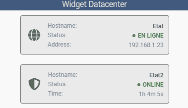
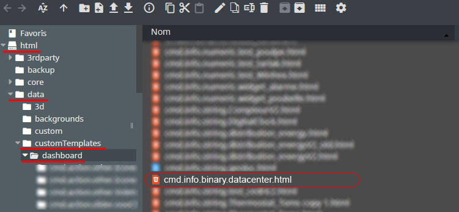
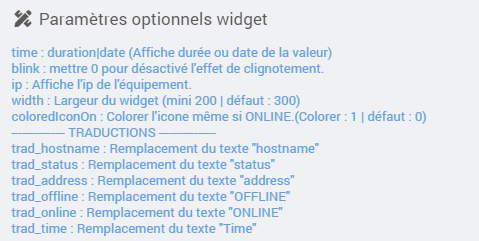

<a href="{{site.url}}/documentation">Accueil</a> --> <a href="{{site.url}}/documentation/{{site.widget}}">Widget</a> --> <a href="{{site.url}}/documentation/{{site.widget}}/fr_FR/info/binary">Info / Binary</a> --> Datacenter

------------

# Widget [Datacenter] 

## 1) Télécharger la source
> - <a href="{{site.url_git}}/WIDGET_cmd.info.binary.datacenter" target="_blank">Télécharger les sources du Widget pour le Core V4</a>

### Version dashboard

- Déposer le fichier <b>cmd.info.binary.datacenter</b> dans le dossier <b>/html/data/customTemplates/dashboard/</b>

  

## Paramètres optionnels

## Questions :
- Pourquoi les couleurs ne s'affiche pas sur le widget ?
  - Dans Réglages / Système / Configuration sous l'onglet "Interface" verifiez que la case "Icônes colorées" est bien cochée.

## Changelog

<a href="./changelog">Changelog</a>

## Aide
> - [Comment récupérer les sources ?]({{site.url}}/documentation/{{site.help}}/fr_FR/download)
> - [Comment ajouter des paramètres ?]({{site.url}}/documentation/{{site.help}}/fr_FR/application)

-------------------

<a href="{{site.url}}/documentation">Accueil</a> --> <a href="{{site.url}}/documentation/{{site.widget}}">Widget</a> --> <a href="{{site.url}}/documentation/{{site.widget}}/fr_FR/info/binary">Info / Binary</a> --> Datacenter