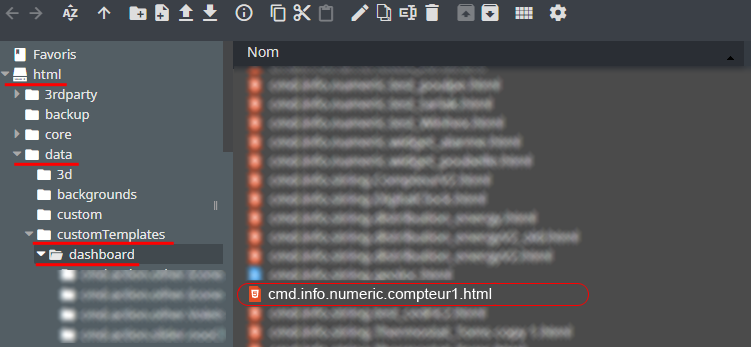
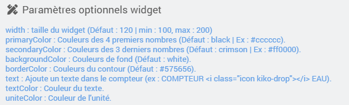

<a href="{{site.url}}/documentation">Accueil</a> --> <a href="{{site.url}}/documentation/{{site.widget}}">Widget</a> --> <a href="{{site.url}}/documentation/{{site.widget}}/fr_FR/info/numeric">Info / Numérique</a> --> Compteur1

------------

# Widget [compteur1] 

<i class="fas fa-exclamation-circle"></i> <strong>info : </strong> Conçu en svg, ce compteur ne necessite pas d'image, ni de police d'écriture (font) supplémentaire.

## 1) Télécharger la source
> - <a href="{{site.url_git}}/WIDGET_cmd.info.numeric.compteur1" target="_blank">Télécharger les sources du Widget pour le Core V4</a>

### Version dashboard

- Déposer le fichier <b>cmd.info.numeric.compteur1.html</b> dans le dossier <b>/html/data/customTemplates/dashboard/</b>

  

## Paramètres optionnels

## Changelog

<a href="./changelog">Changelog</a>

## Aide
> - [Comment récupérer les sources ?]({{site.url}}/documentation/{{site.help}}/fr_FR/download)
> - [Comment ajouter des paramètres ?]({{site.url}}/documentation/{{site.help}}/fr_FR/application)

-------------------

<a href="{{site.url}}/documentation">Accueil</a> --> <a href="{{site.url}}/documentation/{{site.widget}}">Widget</a> --> <a href="{{site.url}}/documentation/{{site.widget}}/fr_FR/info/numeric">Info / Numérique</a> --> Compteur1