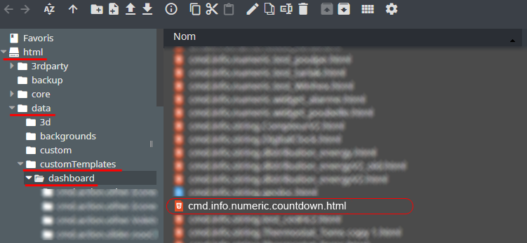
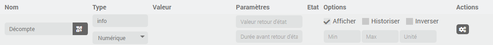
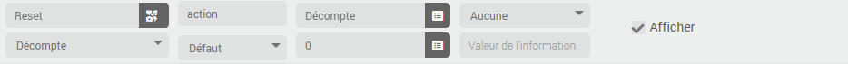
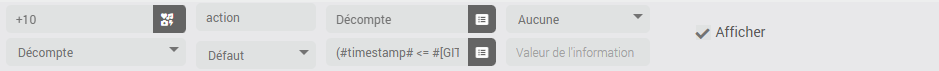
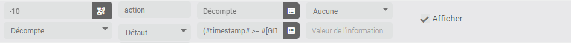
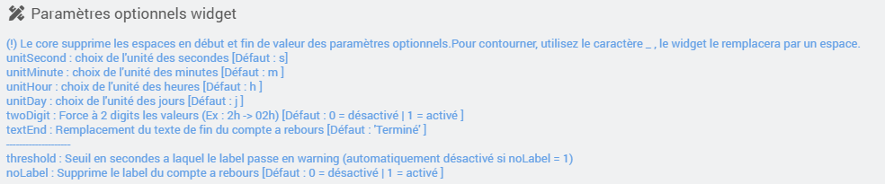

<a href="{{site.url}}/documentation">Accueil</a> --> <a href="{{site.url}}/documentation/{{site.widget}}">Widget</a> --> <a href="{{site.url}}/documentation/{{site.widget}}/fr_FR/info/numeric">Info / Numérique</a> --> Countdown

------------

# Widget [Countdown] 

> [!WARNING]
> test
>
> test 2

<i class="fas fa-exclamation-circle"></i> <strong>info : </strong> Ce widget a pour but d'afficher simplement un compte a rebours en fonction de la valeur (timestamp) de la commande.

## Télécharger la source
> - <a href="{{site.url_git}}/WIDGET_cmd.info.numeric.countdown" target="_blank">Télécharger les sources du Widget pour le Core V4</a>

### Version dashboard

- Déposer le fichier <b>cmd.info.numeric.compteur1.html</b> dans le dossier <b>/html/data/customTemplates/dashboard/</b>

  

## Installation
- Créer un nouveau virtuel.
- Ajouter une commande info / numérique puis lui appliquer le widget `Countdown`.

### Ajout des boutons

####  Bouton reset
Dans ce même équipement ajoutez une commande action/défaut. 

- <i>Nom information : nom de la commande info/numerique qui contient le widget (`Décompte` pour mon exemple)</i>
- <i>Valeur : 0</i>

####  Bouton +
Dans ce même équipement ajoutez une commande action/défaut (Ex : `+10`) 

- <i>Nom information : nom de la commande info/numerique qui contient le widget (`Décompte` pour mon exemple)</i>
- <i>Valeur : `(#timestamp# <= #[Décompte]#) ? (#[Décompte]# + 10) : (#timestamp# + 10)`</i>
  - `#[Décompte]#` a remplacer par le nom complet de votre commande (Ex : `#[Objet][eqLogic][Décompte]#`)

Pour un bouton +60 (+1mn), répéter cette même étape, modifier simplement la valeur du champs `valeur`. 
Ex : `(#timestamp# <= #[Décompte]#) ? (#[Décompte]# + 60) : (#timestamp# + 60)`

####  Bouton -
Toujours dans ce même équipement ajoutez une commande action/défaut.  (Ex : `-10`) 

- <i>Nom information : nom de la commande info/numerique qui contient le widget (`Décompte` pour mon exemple)</i>
- <i>Valeur :</i> `(#timestamp# >= #[Décompte]# - 10) ? 0 : (#[Décompte]# - 10)`
  - `#[Décompte]#` a remplacer par le nom complet de votre commande (Ex : `#[Objet][eqLogic][Décompte]#`)

Pour un bouton -60 (-1mn), répéter cette même étape, modifier simplement le champs `valeur`. 
Ex : `(#timestamp# >= #[Décompte]# - 60) ? 0 : (#[Décompte]# - 60)`

## Paramètres optionnels

## Changelog

<a href="./changelog">Changelog</a>

## Aide
> - [Comment récupérer les sources ?]({{site.url}}/documentation/{{site.help}}/fr_FR/download)
> - [Comment ajouter des paramètres ?]({{site.url}}/documentation/{{site.help}}/fr_FR/application)

-------------------

<a href="{{site.url}}/documentation">Accueil</a> --> <a href="{{site.url}}/documentation/{{site.widget}}">Widget</a> --> <a href="{{site.url}}/documentation/{{site.widget}}/fr_FR/info/numeric">Info / Numérique</a> --> Countdown