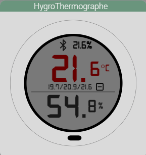
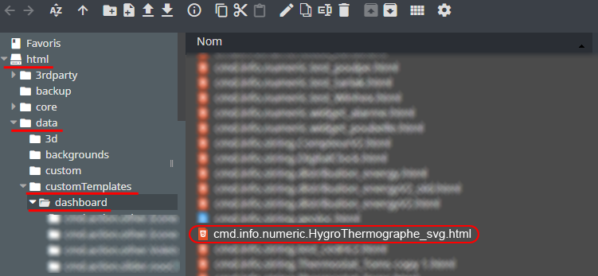
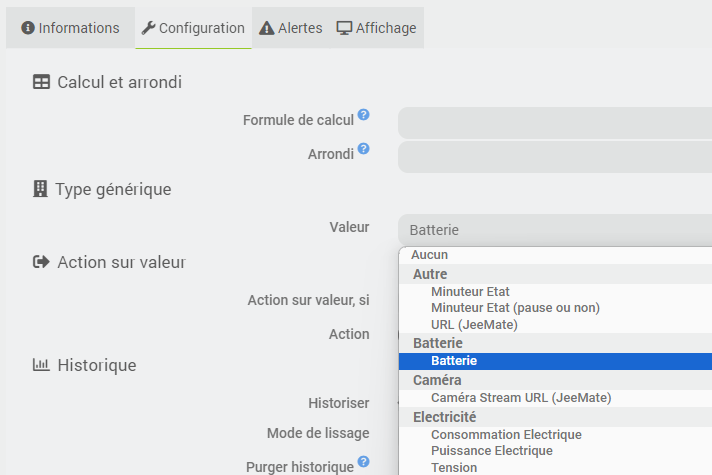
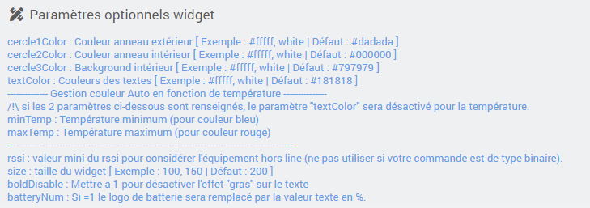
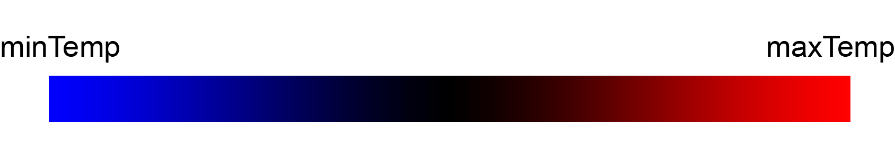

<a href="{{site.url}}/documentation">Accueil</a> --> <a href="{{site.url}}/documentation/{{site.widget}}">Widget</a> --> <a href="{{site.url}}/documentation/{{site.widget}}/fr_FR/info/numeric">Info / Numérique</a> --> HygroThermographe_svg

------------

# Widget [HygroThermographe_svg]  

> **---- BETA ----**
>
> - Ce widget est en version béta.
>

## 1) Télécharger la source
> - <a href="{{site.url_git}}/WIDGET_cmd.info.numeric.HygroThermographe_svg" target="_blank">Télécharger les sources du Widget pour le Core V4</a>

### Version dashboard

- Déposer le fichier <b>cmd.info.numeric.HygroThermographe_svg</b> dans le dossier <b>/html/data/customTemplates/dashboard/</b>

  

------------------------

## 2) Application du widget

- Ce widget est a appliqué sur la commande info numérique de votre température.
- In ne necessite aucune images et autres fichiers, il est entièrement conçu en svg.
- Il utilise les commandes présentent dans ce même équipement grace aux génériques types.

## 3) Les génériques :

Il faudra bien enregistrer les génériques pour chaque commandes :
- Pour l'hygromètrie : Environnement / Humidité
- Pour l'état de la batterie : Batterie / Batterie
- Pour l'état de connection : 
  ### 2 choix :
   1) Si la commande est de type "binaire", utiliser le générique "Autre / Connecté". Si ce générique n'est pas disponible (en 4.3 et <), vous pouvez utiliser "Multimédia / Etat".
   2) Si la commande est de type "numérique", utiliser le générique "Generic /  Générique".

- ### Exemple pour Batterie :
  

## Paramètres optionnels

> **fonctionnement du minTemp et maxTemp**
>
> - Plus votre température aprochera le minTemp, plus la couleur du texte sera bleu, et inversement, plus la temperature se rapprochera de maxTemp et plus le texte sera rouge.
> 
>
> **fonctionnement de rssi**
>
> - Pour utiliser l'info d'état sur une commande info numérique de type rssi utiliser ce paramètre en indiquant la valeur mini a partir de laquelle l'équipement est considéré absent (en général -200)

## Question :
- Pourquoi les statistique ne s'affiche pas sur le widget ?
  - Verifier que votre commande "Température" est bien historisé. 
  - Dans Réglages / Système / Configuration sous l'onglet "Equipement" verifiez que la case "Afficher les statistiques sur les widgets" est bien cochée.
  - Dans la configuration avancée de votre commande "Température" sous l'onglet "Affichage", verifier que la case "Afficher les statistiques" est bien cochée.

## Changelog

<a href="./changelog">Changelog</a>

## Aide
> - [Comment récupérer les sources ?]({{site.url}}/documentation/{{site.help}}/fr_FR/download)
> - [Comment ajouter des paramètres ?]({{site.url}}/documentation/{{site.help}}/fr_FR/application)

-------------------

<a href="{{site.url}}/documentation">Accueil</a> --> <a href="{{site.url}}/documentation/{{site.widget}}">Widget</a> --> <a href="{{site.url}}/documentation/{{site.widget}}/fr_FR/info/numeric">Info / Numérique</a> --> HygroThermographe_svg