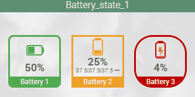
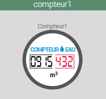
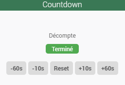
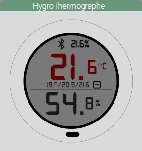
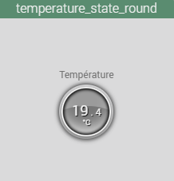
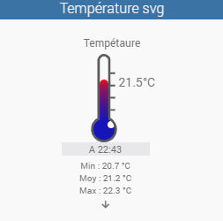

<a href="{{site.url}}/documentation">Accueil</a> --> <a href="{{site.url}}/documentation/{{site.widget}}">Widget</a> --> Info / Numérique

# Widget Info Numeric

| Nom du Widget  | Visuel         | Docs/Téléchargement     | Compatibilité     |
|----------------|----------------|-------------------------|-------------------|
| Battery_state_1 |  | <a href="./battery_state_1"><i class="fas fa-file-download"></i> Lien</a> |  |
| Compteur |  | <a href="./compteur1"><i class="fas fa-file-download"></i> Lien</a> |  |
| Countdown |  | <a href="./countdown"><i class="fas fa-file-download"></i> Lien</a> |  |
| HygroThermographe_svg |  | <a href="./hygroThermographe_svg"><i class="fas fa-file-download"></i> Lien</a> |  |
| Temperature_state_round |  | <a href="./temperature_state_round"><i class="fas fa-file-download"></i> Lien</a> |  |
| Thermometer_svg |  | <a href="./thermometer_svg"><i class="fas fa-file-download"></i> Lien</a> |  |

