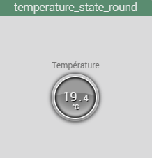
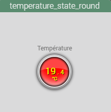
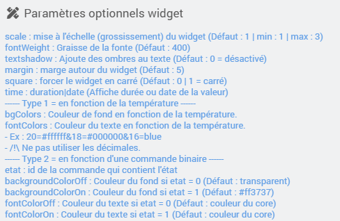

<a href="{{site.url}}/documentation">Accueil</a> --> <a href="{{site.url}}/documentation/{{site.widget}}">Widget</a> --> <a href="{{site.url}}/documentation/{{site.widget}}/fr_FR/info/numeric">Info / Numérique</a> --> temperature_state_round

------------

# Widget [temperature_state_round] 

 

## 1) Télécharger la source
> - <a href="{{site.url_git}}/WIDGET_cmd.info.numeric.temperature_state_round" target="_blank">Télécharger les sources du Widget pour le Core V4</a>

### Version dashboard

- Déposer le fichier <b>cmd.info.numeric.temperature_state_round</b> dans le dossier <b>/html/data/customTemplates/dashboard/</b>

  

------------------------

## 2) Application du widget

- Ce widget est a appliqué sur la commande info numérique de votre température.
- Il ne nécessite aucune images et autres fichiers, il est entièrement conçu en css.

## Paramètres optionnels

## 3) Fonctionnement
Le widget permet de gérer 2 type de fonctionnement :

### Type 1) Changement de couleur en fonction de la température :
Pour ce cas, il faudra seulement utiliser les paramètres `bgColors` et `fontColors`

Exemple pour bgColors : `20=#ffffff&18=#000000&16=blue`

- a 20°C la couleur de fond sera blanche (#ffffff)
- a 18°C la couleur de fond sera noire (#000000)
- a 16°C la couleur de fond sera bleu (blue)

### Type 2) Changement de couleur en fonction d'une commande info binaire :
Pour ce cas, il faudra seulement utiliser le paramètre `etat` avec l'id de la commande binaire.
Par défaut la couleur de fond et couleur de texte sont déja définies, il est possible de les personnaliser avec les paramètres `backgroundColorOn`, `backgroundColorOff`, `fontColorOn` et `fontColorOff`.

## Question :
- Pourquoi les statistique ne s'affiche pas sur le widget ?
  - Verifier que votre commande "Température" est bien historisé. 
  - Dans Réglages / Système / Configuration sous l'onglet "Equipement" verifiez que la case "Afficher les statistiques sur les widgets" est bien cochée.
  - Dans la configuration avancée de votre commande "Température" sous l'onglet "Affichage", verifier que la case "Afficher les statistiques" est bien cochée.

## Changelog

<a href="./changelog">Changelog</a>

## Aide
> - [Comment récupérer les sources ?]({{site.url}}/documentation/{{site.help}}/fr_FR/download)
> - [Comment ajouter des paramètres ?]({{site.url}}/documentation/{{site.help}}/fr_FR/application)

-------------------

<a href="{{site.url}}/documentation">Accueil</a> --> <a href="{{site.url}}/documentation/{{site.widget}}">Widget</a> --> <a href="{{site.url}}/documentation/{{site.widget}}/fr_FR/info/numeric">Info / Numérique</a> --> temperature_state_round