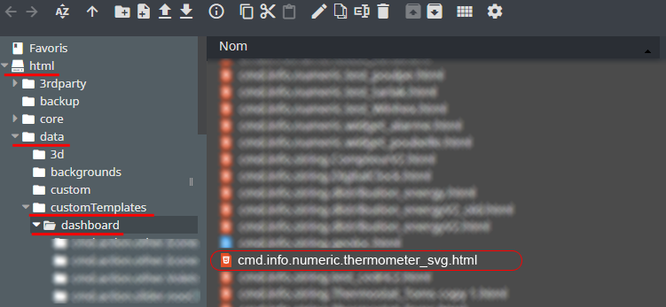

<a href="{{site.url}}/documentation">Accueil</a> --> <a href="{{site.url}}/documentation/{{site.widget}}">Widget</a> --> <a href="{{site.url}}/documentation/{{site.widget}}/fr_FR/info/numeric">Info / Numérique</a> --> thermometer_svg

------------

# Widget [Thermometer_svg] 

## 1) Télécharger la source
> - <a href="{{site.url_git}}/WIDGET_cmd.info.numeric.thermometer_svg" target="_blank">Télécharger les sources du Widget pour le Core V4</a>

### Version dashboard

- Déposer le fichier <b>cmd.info.numeric.thermometer_svg</b> dans le dossier <b>/html/data/customTemplates/dashboard/</b>

  

## Paramètres optionnels

------------------------

## 2) Application du widget

- Ce widget est a appliqué sur la commande info numérique de votre température.
- Il ne nécessite aucune images et autres fichiers, il est entièrement conçu en svg.

<i class="fas fa-exclamation-circle"></i> <strong>info : </strong> Pour un affichage optimal, ajouter un Min et un Max a votre commande info numérique.

## Questions :
- Pourquoi les statistique ne s'affiche pas sur le widget ?
  - Verifier que votre commande est bien historisé. 
  - Dans Réglages / Système / Configuration sous l'onglet "Equipement" verifiez que la case "Afficher les statistiques sur les widgets" est bien cochée.
  - Dans la configuration avancée de votre commande sous l'onglet "Affichage", verifier que la case "Afficher les statistiques" est bien cochée.

## Changelog

<a href="./changelog">Changelog</a>

## Aide
> - [Comment récupérer les sources ?]({{site.url}}/documentation/{{site.help}}/fr_FR/download)
> - [Comment ajouter des paramètres ?]({{site.url}}/documentation/{{site.help}}/fr_FR/application)

-------------------

<a href="{{site.url}}/documentation">Accueil</a> --> <a href="{{site.url}}/documentation/{{site.widget}}">Widget</a> --> <a href="{{site.url}}/documentation/{{site.widget}}/fr_FR/info/numeric">Info / Numérique</a> --> thermometer_svg