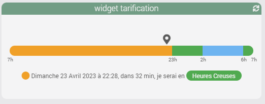
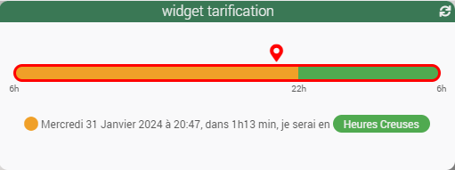
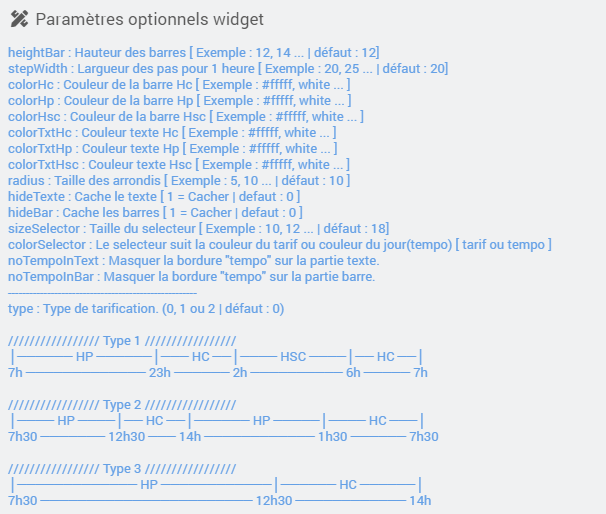

<a href="{{site.url}}/documentation">Accueil</a> --> <a href="{{site.url}}/documentation/{{site.widget}}">Widget</a> --> <a href="{{site.url}}/documentation/{{site.widget}}/fr_FR/info/string">Info / Autre</a> --> Energie tarification

------------

# Widget [Energie Tarification] 

<i>version standard.</i>

<i>Version tempo.</i>

> **Information**
>
> - Ce widget peut être utilisé pour une simple visualisation (version standard), il a un refresh auto toutes les minutes.
> - Il peut aussi être appliqué sur une commande qui renvoie les couleurs tempo (RED, BLUE, WHITE) comme par exemple le plugin <a href="https://jpty.github.io/jeedom/plugins/rteEcowatt/fr_FR/index.html" target="_blank">Rte Ecowatt</a>.

## 1) Télécharger la source
> - <a href="{{site.url_git}}/WIDGET_cmd.info.string.energie_tarification" target="_blank">Télécharger les sources du Widget pour le Core V4</a>

### Version dashboard

- Déposer le fichier <b>cmd.info.string.Energie_tarification</b> dans le dossier <b>/html/data/customTemplates/dashboard/</b>

  

------------------------

## 2) Création d'un virtuel

- Ajoutez une commande Info/Autre, puis sauvegarder (1).
- Attention, ne pas historiser (2).
- Associez le widget à la commande Info/Autre,(3, 4 et 5).

## Paramètres optionnels

## Aide
> - [Comment récupérer les sources ?]({{site.url}}/documentation/{{site.help}}/fr_FR/download)
> - [Comment ajouter des paramètres ?]({{site.url}}/documentation/{{site.help}}/fr_FR/application)

# Changelog

## 2024

### 02/02/2024 (07h20)
- Correction bug d'affichage et calcul pour les type 2 et 3.
- Correction bug d'affichage pour type 0.

 Merci @jpty ;-)

### 01/02/2024 (21h40)

- Ajout d'une tarification supplémentaire.

│───────────── HP ────────────│────── HC ──────│ 
6h30 ─────────────────────── 22h30 ──────────── 6h30

### 31/01/2024 (20h00)

- Réunification de 3 tarifications.
- Modification du widget pour recevoir une info venant d'une commande tempo.

-------------------

<a href="{{site.url}}/documentation">Accueil</a> --> <a href="{{site.url}}/documentation/{{site.widget}}">Widget</a> --> <a href="{{site.url}}/documentation/{{site.widget}}/fr_FR/info/string">Info / Autre</a> --> Energie tarification
