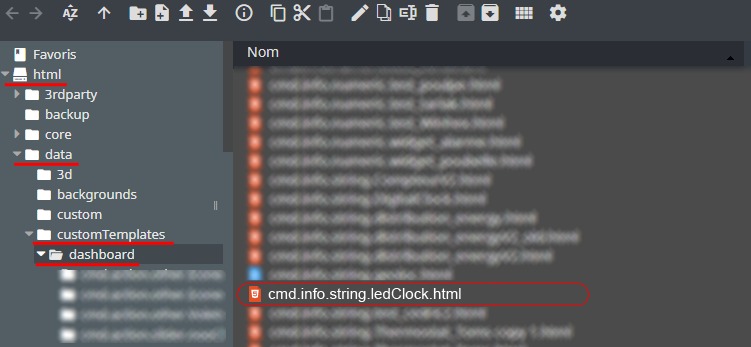
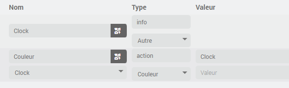
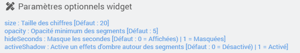

<a href="{{site.url}}/documentation">Accueil</a> --> <a href="{{site.url}}/documentation/{{site.widget}}">Widget</a> --> <a href="{{site.url}}/documentation/{{site.widget}}/fr_FR/info/string">Info / Autre</a> --> LedClock

------------

# Widget [LedClock] 

## Télécharger la source
> - <a href="{{site.url_git}}/WIDGET_cmd.info.string.ledClock" target="_blank">Télécharger les sources du Widget pour le Core V4</a>

### Version dashboard

- Déposer le fichier <b>cmd.info.string.ledClock</b> dans le dossier <b>/html/data/customTemplates/dashboard/</b>

  

## Changement de couleur

Il est possible de changer la couleur de l'horloge en attribuant direct une couleur a la commande info. 
Pour cela, ajouter une commande action / couleur dans ce même équipement et ajouter comme nom d'information la commande précédement créée.

<i>dans mon exemple ci-dessus :
- `Clock` est la commande info / autre qui contient le widget.
- `Couleur` est la commande action / couleur qui viendra changer la couleur de `Clock`
</i>

## Paramètres optionnels

## Changelog

<a href="./changelog">Changelog</a>

## Aide
> - [Comment récupérer les sources ?]({{site.url}}/documentation/{{site.help}}/fr_FR/download)
> - [Comment ajouter des paramètres ?]({{site.url}}/documentation/{{site.help}}/fr_FR/application)

-------------------

<a href="{{site.url}}/documentation">Accueil</a> --> <a href="{{site.url}}/documentation/{{site.widget}}">Widget</a> --> <a href="{{site.url}}/documentation/{{site.widget}}/fr_FR/info/string">Info / Autre</a> --> LedClock