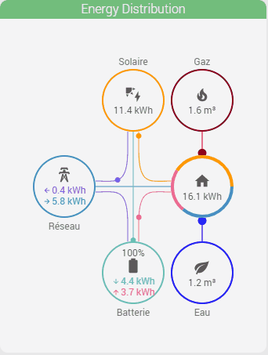
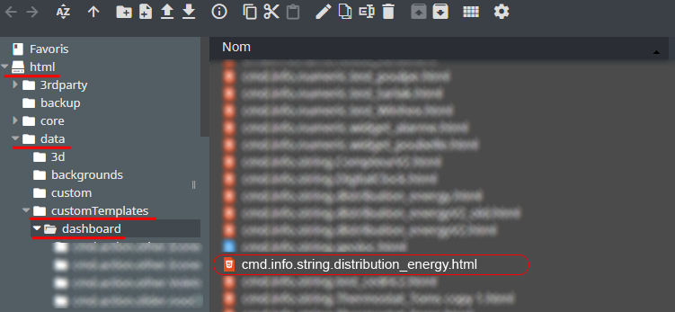
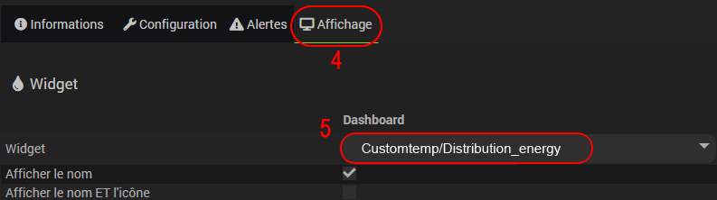
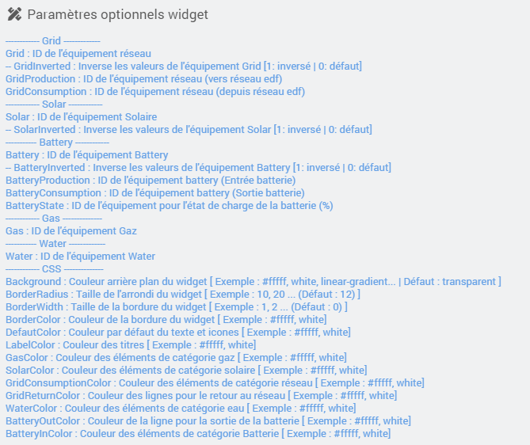

<a href="{{site.url}}/documentation">Accueil</a> --> <a href="{{site.url}}/documentation/{{site.widget}}">Widget</a> --> <a href="{{site.url}}/documentation/{{site.widget}}/fr_FR/widget_scenario">Widgets / Scénarios</a> --> Energie Distribution

------------

# Widget [Energie Distribution]  

> **Information**
>
> - Ce widget est en version béta.
> - Il est basé sur le travail déja [accomplie](https://github.com/ulic75/power-flow-card).
>
> Je ne maitrise pas la totalité du fonctionnement sur les calculs, je compte sur vous pour me faire des retours d'améliorations, et des retours sur le fonctionnement.

## 1) Télécharger la source

> - [Télécharger les sources du Widget pour le Core V4]({{site.url_git}}/WIDGET_cmd.info.string.distribution_energy)

### Version dashboard

- Déposer le fichier <b>cmd.info.string.distribution_energy</b> dans le dossier <b>/html/data/customTemplates/dashboard/</b>

  

------------------------

## 2) Création d'un virtuel

- Ajoutez une commande Info/Autre, puis sauvegarder (1).
- Attention, ne pas historiser (2).
- Associez le widget à la commande Info/Autre,(3, 4 et 5).

## Paramètres optionnels

## Exemples :
si j'ai bien compris :-)
### Réseau
Si vous avez un équipement, ou déja un virtuel qui calcul votre energie venant du réseau (Grid) :
- Utilisation du paramètre "Grid" avec l'ID de l'équipement.
  - Si cette équipement peut renvoyer des valeur négative, il est possible d'utiliser le paramètre "GridInverted" en le passant a 1.

Si vous avez déja 1 ou 2 équipements qui présentent déja des valeurs sur la consommation / production (que des valeur positives !) :
- Utiliser plutôt le paramètre "GridConsumption", si vous avez un autre équipement qui calcul la production (que des valeur positives !), vous pouvez utiliser le paramètre "GridProduction" (pas obligatoire)

### Batterie
Si vous avez un équipement, ou déja un virtuel qui calcul votre energie de la batterie :
- Utilisation du paramètre "Battery" avec l'ID de l'équipement.
  - Si cette équipement peut renvoyer des valeur négative, il est possible d'utiliser le paramètre "BatteryInverted" en le passant a 1.

Si vous avez déja 2 équipements qui présentent déja des valeurs sur la consommation / production (que des valeur positives !) :
- Utiliser plutôt les paramètres "BatteryProduction" et "BatteryConsumption", attention dans ce cas les 2 paramètres sont obligatoires !

## Aide
> - [Comment récupérer les sources ?]({{site.url}}/documentation/{{site.help}}/fr_FR/download)
> - [Comment ajouter des paramètres ?]({{site.url}}/documentation/{{site.help}}/fr_FR/application)

-------------------

<a href="{{site.url}}/documentation">Accueil</a> --> <a href="{{site.url}}/documentation/{{site.widget}}">Widget</a> --> <a href="{{site.url}}/documentation/{{site.widget}}/fr_FR/widget_scenario">Widgets / Scénarios</a> --> Energie Distribution
