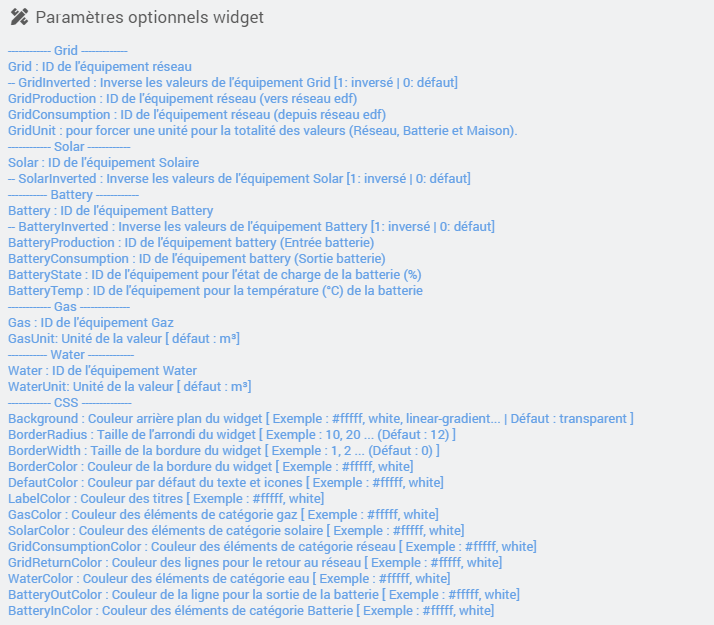

<a href="{{site.url}}/documentation">Accueil</a> --> <a href="{{site.url}}/documentation/{{site.widget}}">Widget</a> --> <a href="{{site.url}}/documentation/{{site.widget}}/fr_FR/widget_scenario">Widgets / Scénarios</a> --> Energie Distribution

------------

# Widget [Energie Distribution]  

> **---- BETA ----**
>
> - Ce widget est en version béta.
> - Il est basé sur le travail déja <a href="https://github.com/ulic75/power-flow-card" target="_blank">accomplie.</a>
>
> Je ne maitrise pas la totalité du fonctionnement sur les calculs... , je compte sur vous pour me faire des retours d'améliorations, et des retours sur le fonctionnement.

> **Information**
>
> - Il n'y a pour le moment aucun refresh automatique du widget, il se mettra a jour seulement au refresh de la page.
> - Toutes les valeurs d'énergie doivent être sur la même unité.
> - Evidemment sur l'image d'exemple, la totalité des infos sont affichés, mais si vous n'utilisez pas d'équipement gaz par exemple, le widget s'adaptera et masquera l'animation gaz.
> 
> - le widget ne fait aucun arrondi, mais il tronque la valeur pour qu'elle s'adapte au cercles (Ex: 123.9999 -> 123.99).
> - Il utilise la même méthode que le core pour convertir les valeurs/unités, (Ex : 1200W sera affiché 1.2Kw)

## 1) Télécharger la source
> - <a href="{{site.url_git}}/WIDGET_cmd.info.string.distribution_energy" target="_blank">Télécharger les sources du Widget pour le Core V4</a>

### Version dashboard

- Déposer le fichier <b>cmd.info.string.distribution_energy</b> dans le dossier <b>/html/data/customTemplates/dashboard/</b>

  

------------------------

## 2) Création d'un virtuel

- Ajoutez une commande Info/Autre, puis sauvegarder (1).
- Attention, ne pas historiser (2).
- Associez le widget à la commande Info/Autre,(3, 4 et 5).

## Paramètres optionnels

> **Info**
>
> - Si le paramètre "GridUnit" n'est pas renseigné, le widget recherchera automatiquement l'unité de votre commande "Grid" ou "GridConsumption".
> - Le paramètre "GridUnit" est prioritaire sur l'unité des équipements.

## Exemples :

### Valeurs combinées
Si vous utilisez un équipement "réseau", "batterie" ou "solaire" qui envoit des valeurs positives pour consommation et des valeurs négatives pour la production :
- Pour le réseau : utiliser le paramètre "Grid" avec l'ID de l'équipement.
- Pour la batterie : utiliser le paramètre "Battery" avec l'ID de l'équipement.
- Pour le Solaire : utiliser le paramètre "Solar" avec l'ID de l'équipement.

### Valeurs inversées
Si en revanche un de votre équipement est inversé (négatif = consommation et positif = production) utilisé les même paramètres que combinées, mais en ajoutant un nouveau paramètre :
- Pour le réseau : ajouter le paramètre "GridInverted" avec valeur = 1.
- Pour la batterie : ajouter le paramètre "BatteryInverted" avec valeur = 1.
- Pour le solaire : ajouter le paramètre "SolarInverted" avec valeur = 1.

### Valeurs fractionnées
Si vos équipements "réseau" ou "batterie" envoient des valeurs fractionnées, c'est à dire 2 valeurs positives, 1 pour la consommation et 1 pour la production.
- Pour le réseau, utiliser simplement les paramètres suivant :
  - "GridProduction" (production vers réseau) avec l'ID de l'équipement.
  - "GridConsumption" (réseau vers maison) avec l'ID de l'équipement.
- Pour la batterie, utiliser simplement les paramètres suivant :
  - "BatteryProduction" (entrée batterie) avec l'ID de l'équipement.
  - "BatteryConsumption" (sortie batterie) avec l'ID de l'équipement.

## Changelog

<a href="./changelog">Changelog</a>

## Aide
> - [Comment récupérer les sources ?]({{site.url}}/documentation/{{site.help}}/fr_FR/download)
> - [Comment ajouter des paramètres ?]({{site.url}}/documentation/{{site.help}}/fr_FR/application)

-------------------

<a href="{{site.url}}/documentation">Accueil</a> --> <a href="{{site.url}}/documentation/{{site.widget}}">Widget</a> --> <a href="{{site.url}}/documentation/{{site.widget}}/fr_FR/widget_scenario">Widgets / Scénarios</a> --> Energie Distribution
