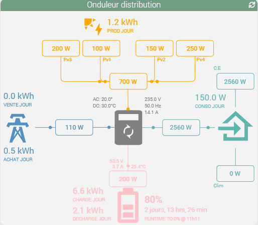
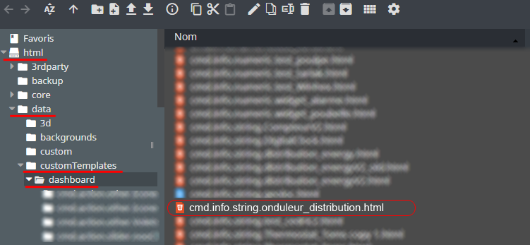
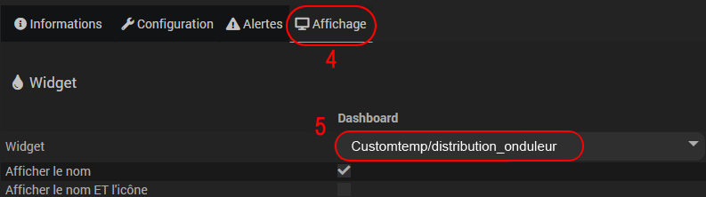
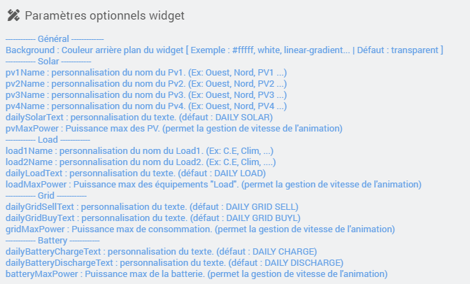
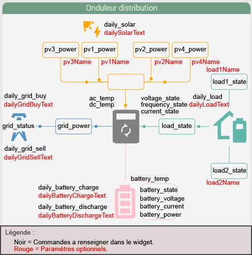
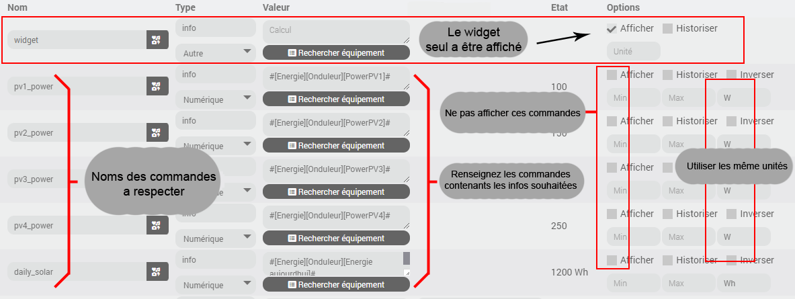

<a href="{{site.url}}/documentation">Accueil</a> --> <a href="{{site.url}}/documentation/{{site.widget}}">Widget</a> --> <a href="{{site.url}}/documentation/{{site.widget}}/fr_FR/widget_scenario">Widgets / Scénarios</a> --> Distribution Onduleur

------------

# Widget [Onduleur Distribution]  

> **---- BETA ----**
>
> - Ce widget est en version béta.
> - Il est basé sur le travail déja <a href="https://github.com/slipx06/sunsynk-power-flow-card" target="_blank">accomplie.</a>
>

> **Information**
>
> - Pour chaques éléments les unités des commandes doivent être identiques.
> 
> - Contrairement au widget <a href="../distribution_energie" target="_blank">Distribution Energie</a> ce widget fait très peu de calculs.

## 1) Télécharger la source
> - <a href="{{site.url_git}}/WIDGET_cmd.info.string.distribution_onduleur" target="_blank">Télécharger les sources du Widget pour le Core V4</a>

### Version dashboard

- Déposer le fichier <b>cmd.info.string.onduleur_distribution</b> dans le dossier <b>/html/data/customTemplates/dashboard/</b>

  

------------------------

## 2) Création d'un virtuel

- Ajoutez une commande Info/Autre, puis sauvegarder (1).
- Attention, ne pas historiser (2).
- Associez le widget à la commande Info/Autre,(3, 4 et 5).

## Paramètres optionnels

> **Information**
>
> - le paramètre optionnel batteryMaxPower permet , si il est renseigné, de calculer la durée restante / temps de charge.

## 3) Ajout des données

Ce widget utilise les commandes présentent dans ce même équipement.
Il faut donc utiliser des noms de commandes infos prédéfinis suivant les tableaux ci-dessous :

### Solaire

| Nom | Obligatoire ? | Description |
| ------ | ------ | ------ |
| pv1_power | non | Puissance instantanée Pv1 |
| pv2_power | non | Puissance instantanée Pv2 |
| pv3_power | non | Puissance instantanée Pv3 |
| pv3_power | non | Puissance instantanée Pv4 |
| daily_solar | non | Consommation solaire quotidienne |

> **Info**
>
> - Si vous possèdez 1 seul reseau PV, utilisez avant tout pv1 power.
> - Si aucun des pv power n'est renseigné, la partie solaire sera automatiquement masqué.

### Batterie

| Nom | Obligatoire ? | Description |
| ------ | ------ | ------ |
| battery_state | non | Pourcentage de batterie. |
| battery_temp | non | Température de la batterie. |
| battery_voltage | non | Tension de la batterie. |
| battery_current | non | Intensité de la batterie. |
| battery_power | non | Puissance instantanée. (positive = décharge / négative = charge)|
| daily_battery_charge | non | Consommation de charge quotidienne. |
| daily_battery_discharge | non | Consommation de décharge quotidienne. |

> **Info**
>
> - Contrairement a la partie PV, Si aucune de ces infos est présente, la tuile "Batterie" ne sera pas masquée.

### Réseau

| Nom | Obligatoire ? | Description |
| ------ | ------ | ------ |
| daily_grid_buy | non | Consommation venant du réseau quotidienne. |
| daily_grid_sell | non | Injection au réseau quotidienne. |
| grid_power | non | Puissance instantanée. (positive = conso / négative = injection) |
| grid_status | non | État de connexion au réseau. (binaire)|

### Load

| Nom | Obligatoire ? | Description |
| ------ | ------ | ------ |
| daily_load | non | Consommation des équipements "Load" quotidien. |
| load_state | non | Puissance instantanée globale. |
| load1_state | non | Puissance instantanée du recepteur 1. |
| load2_state | non | Puissance instantanée du recepteur 2. |

> **Info**
>
> Contrairement a la partie PV, Si aucune de ces infos est présente, la tuile "Load" ne sera pas masquée.
>
> Si load_state n'est pas défini, il sera alors calculé par addition de load1_state + load2_state .
>
>

### Onduleur

| Nom | Obligatoire ? | Description |
| ------ | ------ | ------ |
| ac_temp | non | Température AC. |
| dc_temp | non | Température DC. |
| voltage_state | non | Tension de l'onduleur. |
| frequency_state | non | Fréquence de l'onduleur. |
| current_state | non | Intensité de l'onduleur. |

## Exemple :

## Changelog

<a href="./changelog">Changelog</a>

## Todo

- Gerer les couleurs via paramètres optionnels.
- Ajout I & U sous chaque Pv via nouvelles commandes.
- Ajout d'icones pour les Load via un paramètre optionnel.
- Gérer un mini de battery a X% via un paramètre optionnel.

## Aide
> - [Comment récupérer les sources ?]({{site.url}}/documentation/{{site.help}}/fr_FR/download)
> - [Comment ajouter des paramètres ?]({{site.url}}/documentation/{{site.help}}/fr_FR/application)

-------------------

<a href="{{site.url}}/documentation">Accueil</a> --> <a href="{{site.url}}/documentation/{{site.widget}}">Widget</a> --> <a href="{{site.url}}/documentation/{{site.widget}}/fr_FR/widget_scenario">Widgets / Scénarios</a> --> Distribution Onduleur
