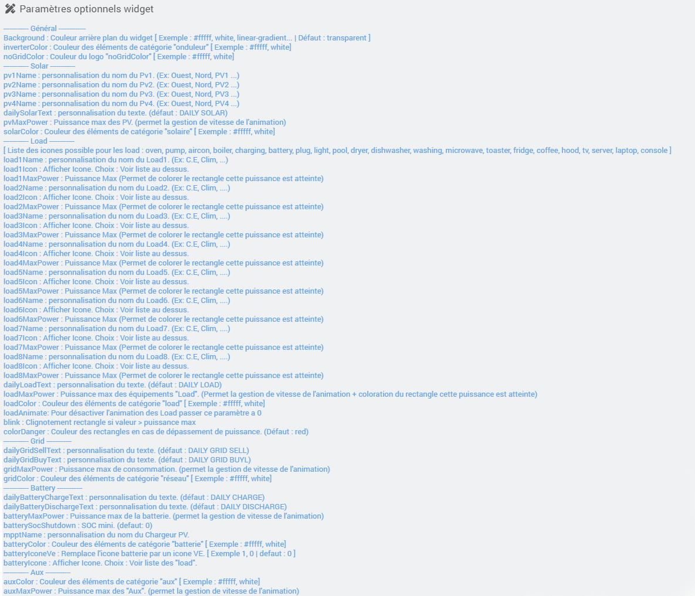
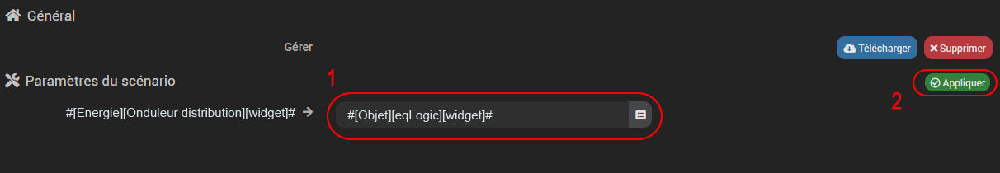

<a href="{{site.url}}/documentation">Accueil</a> --> <a href="{{site.url}}/documentation/{{site.widget}}">Widget</a> --> <a href="{{site.url}}/documentation/{{site.widget}}/fr_FR/widget_scenario">Widgets / Scénarios</a> --> Distribution Onduleur

------------

# Widget [Onduleur Distribution]  

> **Information**
>- Ce widget est basé sur le travail déja <a href="https://github.com/slipx06/sunsynk-power-flow-card" target="_blank">accomplie.</a>
>
> - Pour chaques éléments les unités des commandes doivent être identiques.
> 
> - Contrairement au widget <a href="../distribution_energie" target="_blank">Distribution Energie</a> ce widget fait moins de calculs.

## 1) Télécharger la source
> - <a href="{{site.url_git}}/WIDGET_cmd.info.string.distribution_onduleur" target="_blank">Télécharger la source du widget pour le Core V4</a>

### Version dashboard

- Déposer le fichier <b>cmd.info.string.onduleur_distribution</b> dans le dossier <b>/html/data/customTemplates/dashboard/</b>

  

------------------------

## 2) Création d'un virtuel

- Ajoutez une commande Info/Autre, puis sauvegarder (1).
- Attention, ne pas historiser (2).
- Associez le widget à la commande Info/Autre,(3, 4 et 5).

## Paramètres optionnels

> **Information**
>
> - le paramètre optionnel batteryMaxPower permet , si il est renseigné, de calculer la durée restante / temps de charge.

## 3) Ajout des données

Ce widget utilise les commandes présentent dans ce même équipement.
Il faut donc utiliser des noms de commandes infos prédéfinis suivant les tableaux ci-dessous, les unités  :

### Solaire

| Nom | Obligatoire ? | Description |
| ------ | ------ | ------ |
| pv_power * | non | Puissance instantanée Total |
| pv1_power | non | Puissance instantanée Pv1 |
| pv1_energy | non | Energie PV1 |
| pv1_voltage | non | Tension Pv1 |
| pv1_current | non | Intensité Pv1 |
| pv2_power | non | Puissance instantanée Pv2 |
| pv2_energy | non | Energie PV2 |
| pv2_voltage | non | Tension Pv2 |
| pv2_current | non | Intensité Pv2 |
| pv3_power | non | Puissance instantanée Pv3 |
| pv3_energy | non | Energie PV3 |
| pv3_voltage | non | Tension Pv3 |
| pv3_current | non | Intensité Pv3 |
| pv4_power | non | Puissance instantanée Pv4 |
| pv4_energy | non | Energie PV4 |
| pv4_voltage | non | Tension Pv4 |
| pv4_current | non | Intensité Pv4 |
| daily_solar | non | Production solaire quotidienne |

> **Info**
>
> - Si vous possèdez 1 seul reseau PV, utilisez avant tout pv1 power.
> - Si aucun des pv power n'est renseigné, la partie solaire sera automatiquement masqué.
> -  * pv_power : Si cette commande n'est pas existante, le widget fera la somme des pv. 

### Batterie

| Nom | Obligatoire ? | Description |
| ------ | ------ | ------ |
| battery_state | non | Pourcentage de batterie. |
| battery_temp | non | Température de la batterie. |
| battery_voltage | non | Tension de la batterie. |
| battery_current | non | Intensité de la batterie. |
| battery_power | non | Puissance instantanée. (positive = décharge / négative = charge)|
| daily_battery_charge | non | Consommation de charge quotidienne. |
| daily_battery_discharge | non | Consommation de décharge quotidienne. |
| battery_mppt_power | non | Puissance instantanée du mppt de la batterie. |
| battery_mppt_energy | non | Consommation du mppt de la batterie. |

> **Info**
>
> - Si "battery_power" n'est renseigné, la partie "batterie" sera automatiquement masquée.
>

### Aux

| Nom | Obligatoire ? | Description |
| ------ | ------ | ------ |
| aux_power | non | Puissance instantanée. |
| daily_aux | non | Production auxiliaire quotidienne. |

> **Info**
>
> - Si "aux_power" n'est renseigné, la partie "Aux" sera automatiquement masquée.
>

### Réseau

| Nom | Obligatoire ? | Description |
| ------ | ------ | ------ |
| daily_grid_buy | non | Consommation venant du réseau quotidienne. |
| daily_grid_sell | non | Injection au réseau quotidienne. |
| grid_power | non | Puissance instantanée. (positive = conso / négative = injection) |
| grid_status | non | État de connexion au réseau. (binaire)|

### Load

| Nom | Obligatoire ? | Description |
| ------ | ------ | ------ |
| daily_load | non | Consommation des équipements "Load" quotidien. |
| load_state | non | Puissance instantanée globale. |
| load1_state | non | Puissance instantanée du recepteur 1. |
| load1_energy | non | Energie recepteur 1. |
| load1_perso | non | Info perso du load1. |
| load2_state | non | Puissance instantanée du recepteur 2. |
| load2_energy | non | Energie recepteur 2. |
| load2_perso | non | Info perso du load2. |
| load3_state | non | Puissance instantanée du recepteur 3. |
| load3_energy | non | Energie recepteur 3. |
| load3_perso | non | Info perso du load3. |
| load4_state | non | Puissance instantanée du recepteur 4. |
| load4_energy | non | Energie recepteur 4. |
| load4_perso | non | Info perso du load4. |
| load5_state | non | Puissance instantanée du recepteur 5. |
| load5_energy | non | Energie recepteur 5. |
| load5_perso | non | Info perso du load5. |
| load6_state | non | Puissance instantanée du recepteur 6. |
| load6_energy | non | Energie recepteur 6. |
| load6_perso | non | Info perso du load6. |
| load7_state | non | Puissance instantanée du recepteur 7. |
| load7_energy | non | Energie recepteur 7. |
| load7_perso | non | Info perso du load7. |
| load8_state | non | Puissance instantanée du recepteur 8. |
| load8_energy | non | Energie recepteur 8. |
| load8_perso | non | Info perso du load8. |

> **Info**
>
> - Si "load_state" et "load1_state" ne sont pas renseignés, la partie "Load" sera automatiquement masquée.
>
> - Si load_state n'est pas défini, il sera alors calculé par addition de load1_state + load2_state .
>
>

### Onduleur

| Nom | Obligatoire ? | Description |
| ------ | ------ | ------ |
| ac_temp | non | Température AC. |
| dc_temp | non | Température DC. |
| voltage_state | non | Tension de l'onduleur. |
| frequency_state | non | Fréquence de l'onduleur. |
| current_state | non | Intensité de l'onduleur. |

## Exemple :

> **Légende** : 
>  <b>Noir :</b> Commandes a renseigner dans l'équipement.
>  <b>Rouge :</b> Paramètres optionnels.
>
> <b>* pv_power :</b> ci cette commande n'est pas existante, le widget affichera la somme des pv.

-------------------------

## 3) Partie Tempo

### Avec le plugin "rteEcowatt"
- Affichage de la couleur du jour et du lendemain.

Il faudra télécharger le template <a href="{{site.url_git}}/WIDGET_cmd.info.string.distribution_onduleur" target="_blank">distribution_onduleur_tempo.json</a>. 
<i>Vous pouvez suivre <a href='../../../../help/fr_FR/template_scenario' target="_blank">l'aide a l'installation d'un template</a>.</i> 

Commande de remplacement :

(1) Recherchez la commande sur laquelle vous avez appliqué le widget précédemment. 
(2) Appliquer la modification.

### Sans le plugin "rteEcowatt"
- Affichage seulement de la couleur du jour

Il suffit simplement d'envoyer une des couleurs (RED,WHITE ou BLUE) sur la commande ou vous avez appliqué le widget précédemment.

## Changelog

<a href="./changelog">Changelog</a>

## Todo

- Affichage d'un greenPower.

## Aide
> - [Comment récupérer les sources ?]({{site.url}}/documentation/{{site.help}}/fr_FR/download)
> - [Comment ajouter des paramètres ?]({{site.url}}/documentation/{{site.help}}/fr_FR/application)

-------------------

<a href="{{site.url}}/documentation">Accueil</a> --> <a href="{{site.url}}/documentation/{{site.widget}}">Widget</a> --> <a href="{{site.url}}/documentation/{{site.widget}}/fr_FR/widget_scenario">Widgets / Scénarios</a> --> Distribution Onduleur
