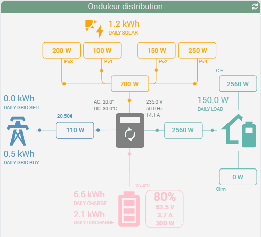

<a href="{{site.url}}/documentation">Accueil</a> --> <a href="{{site.url}}/documentation/{{site.widget}}">Widget</a> --> <a href="{{site.url}}/documentation/{{site.widget}}/fr_FR/widget_scenario">Widgets / Scénarios</a> --> Distribution Onduleur

------------

# Widget [Energie Distribution]  

> **---- BETA ----**
>
> - Ce widget est en version béta.
> - Il est basé sur le travail déja <a href="https://github.com/slipx06/sunsynk-power-flow-card" target="_blank">accomplie.</a>
>

> **Information**
>
> - Pour chaques éléments les unités des commandes doivent être identiques.
> 

## 1) Télécharger la source
> - <a href="{{site.url_git}}/WIDGET_cmd.info.string.onduleur_distribution" target="_blank">Télécharger les sources du Widget pour le Core V4</a>

### Version dashboard

- Déposer le fichier <b>cmd.info.string.onduleur_distribution</b> dans le dossier <b>/html/data/customTemplates/dashboard/</b>

  

------------------------

## 2) Création d'un virtuel

- Ajoutez une commande Info/Autre, puis sauvegarder (1).
- Attention, ne pas historiser (2).
- Associez le widget à la commande Info/Autre,(3, 4 et 5).

## Paramètres optionnels

> **Info**
>
> - Si le paramètre "GridUnit" n'est pas renseigné, le widget recherchera automatiquement l'unité de votre commande "Grid" ou "GridConsumption".
> - Le paramètre "GridUnit" est prioritaire sur l'unité des équipements.

## 3) Ajout des données

Ce widget utilise les commandes présente dans ce même équipement.
Il faut donc utilisé des noms de commandes infos prédéfinis suivant le tableau si dessous :

 ### Solaire

| Nom | Obligatoire ? | Description |
| ------ | ------ | ------ |
| pv1_power | non | Puissance instantanée Pv1 |
| pv2_power | non | Puissance instantanée Pv1 |
| pv3_power | non | Puissance instantanée Pv1 |
| pv3_power | non | Puissance instantanée Pv1 |
| daily_solar | non | Consommation solaire quotidienne |
> **Info**
>
> - Si vous possèdez 1 seul reseau PV, utilisez avant tout pv1 power.
> - Si aucun des pv power n'est renseigné, la partie solaire sera automatiquement masqué.

### Batterie

| Nom | Obligatoire ? | Description |
| ------ | ------ | ------ |
| battery_state | non | Pourcentage de batterie. |
| battery_temp | non | Température de la batterie. |
| battery_voltage | non | Tension de la batterie. |
| battery_current | non | Intensité de la batterie. |
| battery_power | non | Puissance instantanée. (positive = décharge / négative = charge)|
| daily_battery_charge | non | Consommation de charge quotidienne. |
| daily_battery_discharge | non | Consommation de décharge quotidienne. |

> **Info**
>
> - Contrairement a la partie PV, Si aucune de ces infos est présente, la tuile "Batterie" ne sera pas masqué.

### Réseau

| Nom | Obligatoire ? | Description |
| ------ | ------ | ------ |
| daily_grid_buy | non | Consommation venant du réseau quotidienne. |
| daily_grid_sell | non | Injection au réseau quotidienne. |
| grid_power | non | Puissance instantanée. (positive = conso / négative = injection) |
| grid_status | non | État de connexion au réseau. (binaire)|

### Onduleur

| Nom | Obligatoire ? | Description |
| ------ | ------ | ------ |
| ac_temp | non | Température AC. |
| dc_temp | non | Température DC. |
| voltage_state | non | Tension de l'onduleur. |
| frequency_state | non | Fréquence de l'onduleur. |
| current_state | non | Intensité de l'onduleur. |

## Changelog

<a href="./changelog">Changelog</a>

## Aide
> - [Comment récupérer les sources ?]({{site.url}}/documentation/{{site.help}}/fr_FR/download)
> - [Comment ajouter des paramètres ?]({{site.url}}/documentation/{{site.help}}/fr_FR/application)

-------------------

<a href="{{site.url}}/documentation">Accueil</a> --> <a href="{{site.url}}/documentation/{{site.widget}}">Widget</a> --> <a href="{{site.url}}/documentation/{{site.widget}}/fr_FR/widget_scenario">Widgets / Scénarios</a> --> Distribution Onduleur
