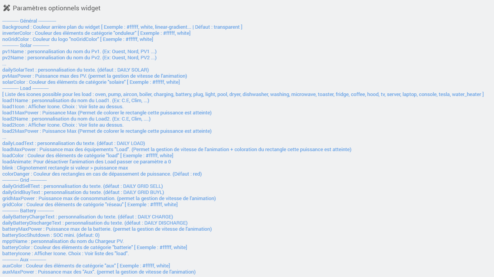
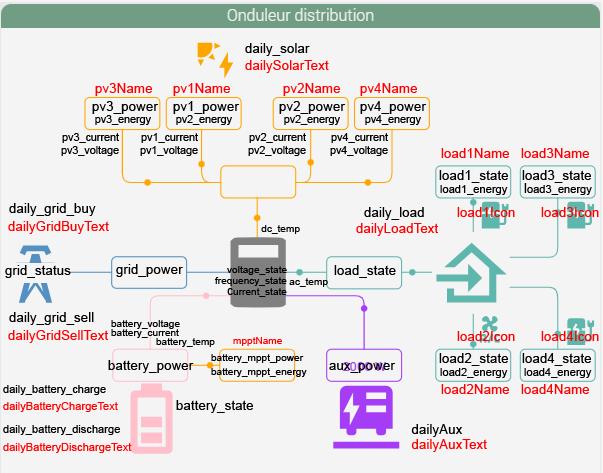

<a href="{{site.url}}/documentation">Accueil</a> --> <a href="{{site.url}}/documentation/{{site.widget}}">Widget</a> --> <a href="{{site.url}}/documentation/{{site.widget}}/fr_FR/widget_scenario">Widgets / Scénarios</a> --> Distribution Onduleur

------------

# Widget [Onduleur Distribution]  

> **Information**
> - Ce widget est basé sur le travail déja <a href="https://github.com/slipx06/sunsynk-power-flow-card" target="_blank">accompli.</a>
>
> - Pour chaque élément les unités des commandes doivent être identiques.
> 
> - Contrairement au widget <a href="../distribution_energie" target="_blank">Distribution Energie</a> ce widget fait moins de calculs.

## 1) Téléchargement de la source
> - <a href="{{site.url_git}}/WIDGET_cmd.info.string.distribution_onduleur" target="_blank">Téléchargez la source du widget pour le Core V4</a>

### Version dashboard

- Déposez le fichier <b>cmd.info.string.onduleur_distribution</b> dans le dossier <b>/html/data/customTemplates/dashboard/</b>

  

------------------------

## 2) Création d'un virtuel

- Ajoutez une commande Info/Autre, puis sauvegardez (1).
- Attention, ne pas historiser (2).
- Associez le widget à la commande Info/Autre (3, 4 et 5).

## Paramètres optionnels

> **Information**
>
> - le paramètre optionnel batteryMaxPower permet, s'il est renseigné, de calculer la durée restante / temps de charge.

## 3) Ajout des données

Ce widget utilise les commandes présentes dans ce même équipement.
Il faut donc utiliser des noms de commande info prédéfinis suivant les tableaux ci-dessous :

### Solaire

| Nom | Obligatoire ? | Description |
| ------ | ------ | ------ |
| daily_solar | non | Production solaire quotidienne |
| pv_power * | non | Puissance instantanée totale |
| pv1_power | non | Puissance instantanée PV1 |
| pv1_energy | non | Energie PV1 |
| pv1_voltage | non | Tension PV1 |
| pv1_current | non | Intensité PV1 |

> **Info**
>
> - Dans le tableau ci-dessus l'ajout de PV supplémentaires est infini, exemple pour un 2ème PV, utilisez pv2_power...
> - Si vous possédez 1 seul PV, utilisez avant tout pv1_power.
> - Si aucun des pv*_power n'est renseigné, la partie solaire sera automatiquement masquée.
> - pv_power * : Si cette commande n'existe pas, le widget affichera la somme des pv.

### Batterie

| Nom | Obligatoire ? | Description |
| ------ | ------ | ------ |
| battery_state | non | Pourcentage de batterie. |
| battery_temp | non | Température de la batterie. |
| battery_voltage | non | Tension de la batterie. |
| battery_current | non | Intensité de la batterie. |
| battery_power | non | Puissance instantanée. (positive = décharge / négative = charge)|
| daily_battery_charge | non | Consommation de charge quotidienne. |
| daily_battery_discharge | non | Consommation de décharge quotidienne. |
| battery_mppt_power | non | Puissance instantanée du mppt de la batterie. |
| battery_mppt_energy | non | Consommation du mppt de la batterie. |

> **Info**
>
> - Si "battery_power" n'est pas renseigné, la partie "batterie" sera automatiquement masquée.

### Aux

| Nom | Obligatoire ? | Description |
| ------ | ------ | ------ |
| aux_power | non | Puissance instantanée. |
| daily_aux | non | Production auxiliaire quotidienne. |

> **Info**
>
> - Si "aux_power" n'est pas renseigné, la partie "Aux" sera automatiquement masquée.

### Réseau

| Nom | Obligatoire ? | Description |
| ------ | ------ | ------ |
| daily_grid_buy | non | Consommation venant du réseau quotidienne. |
| daily_grid_sell | non | Injection au réseau quotidienne. |
| grid_power | non | Puissance instantanée. (positive = consommation / négative = injection) |
| grid_status | non | État de connexion au réseau. (binaire)|

### Load

| Nom | Obligatoire ? | Description |
| ------ | ------ | ------ |
| daily_load | non | Consommation des équipements "Load" quotidienne. |
| load_state | non | Puissance instantanée globale. |
| load1_power | non | Puissance instantanée du récepteur 1. |
| load1_energy | non | Energie récepteur 1. |
| load1_perso | non | Info perso du récepteur 1. |

> **Info**
> - Dans le tableau ci-dessus l'ajout de load supplémentaires est infini, exemple pour un 2ème load, utilisez load2_power...
>
> - Si "load_state" et "loadx_state" ne sont pas renseignés, la partie "Load" sera automatiquement masquée.
>
> - Si load_state n'est pas défini, il sera alors calculé par addition de load1_state + load2_state + ...

### Onduleur

| Nom | Obligatoire ? | Description |
| ------ | ------ | ------ |
| ac_temp | non | Température AC. |
| dc_temp | non | Température DC. |
| voltage_state | non | Tension de l'onduleur. |
| frequency_state | non | Fréquence de l'onduleur. |
| current_state | non | Intensité de l'onduleur. |
| lcd_state | non | Info à afficher dans l'afficheur LCD'. |

## Exemple :

> **Légende** : 
>  <b>Noir :</b> Commandes à renseigner dans l'équipement.
>  <b>Rouge :</b> Paramètres optionnels.
>
> <b>* pv_power :</b> ci cette commande n'existe pas, le widget affichera la somme des pv.

-------------------------

## 3) Partie Tempo

### Avec le plugin "rteEcowatt"
- Affichage de la couleur du jour et du lendemain.

Il faudra télécharger le template <a href="{{site.url_git}}/WIDGET_cmd.info.string.distribution_onduleur" target="_blank">distribution_onduleur_tempo.json</a>. 
<i>Vous pouvez suivre <a href='../../../../help/fr_FR/template_scenario' target="_blank">l'aide à l'installation d'un template</a>.</i> 

Commande de remplacement :

(1) Recherchez la commande sur laquelle vous avez appliqué le widget précédemment. 
(2) Appliquez la modification.

### Sans le plugin "rteEcowatt"
- Affichage de la couleur du jour seulement.

Il suffit simplement d'envoyer une des couleurs (RED, WHITE ou BLUE) sur la commande à laquelle vous avez appliqué le widget précédemment.

## 3) Icones dispo :

| ------ | ------ | ------ | ------ | ------ |
| 
Four (oven)  | 
Pompe (pump)  | 
Clim (aircon)  | 
Chaudière (boiler)  | 
Chargeur (charging)  |
| 
Batterie (battery)  | 
Prise (plug)  | 
Piscine (pool)  | 
Sèche linge (dryer)  | 
Lave vaisselle (dishwasher)  |
| 
Machine a laver (washing)  | 
Micro-ondes (microwave)  | 
Grille-pain (toaster)  | 
Réfrigérateur (fridge)  | 
Cafetière (coffee)  |
| 
hotte (hood)  | 
Lumière (light)  | 
Ecran tv (tv)  | 
Serveur (server)  | 
Ordinateur portable (laptop)  |
| 
Console (console)  | 
Voiture électrique (ve)  | 
Logo Tesla (tesla)  | 
Chauffe-eau (water_heater)  |  |

## Changelog

<a href="./changelog">Changelog</a>

## Todo

- Affichage d'un greenPower.

## Aide
> - [Comment récupérer les sources ?]({{site.url}}/documentation/{{site.help}}/fr_FR/download)
> - [Comment ajouter des paramètres ?]({{site.url}}/documentation/{{site.help}}/fr_FR/application)

-------------------

<a href="{{site.url}}/documentation">Accueil</a> --> <a href="{{site.url}}/documentation/{{site.widget}}">Widget</a> --> <a href="{{site.url}}/documentation/{{site.widget}}/fr_FR/widget_scenario">Widgets / Scénarios</a> --> Distribution Onduleur
