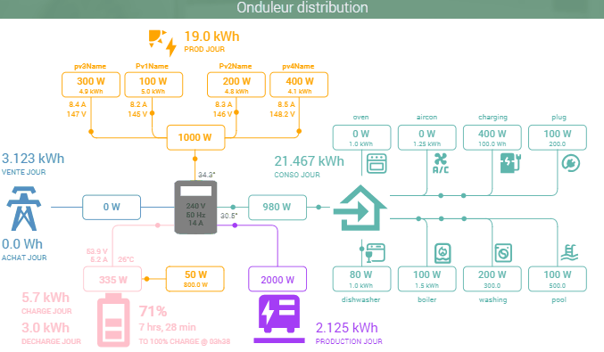
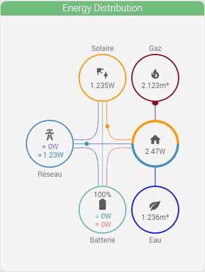
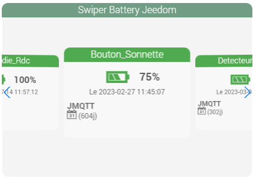

<a href="{{site.url}}/documentation">Accueil</a> --> <a href="{{site.url}}/documentation/{{site.widget}}">Widget</a> --> Widgets / Scénarios

# Widgets / Scénario

| Nom du Widget  | Visuel         | Docs/Téléchargement     | Compatibilité     |
|----------------|----------------|-------------------------|-------------------|
| Distribution onduleur |  | <a href="./distribution_onduleur"><i class="fas fa-file-download"></i> Lien</a> |   |
| Distribution energie |  | <a href="./distribution_energie"><i class="fas fa-file-download"></i> Lien</a> |   |
| Info du jour |  | <a href="./info_du_jour"><i class="fas fa-file-download"></i> Lien</a> |  |
| Swiper Battery Jeedom |  | <a href="./swiper_battery_jeedom"><i class="fas fa-file-download"></i> Lien</a> |  |
| Info Backup |  | <a href="./info_backup"><i class="fas fa-file-download"></i> Lien</a> |  |