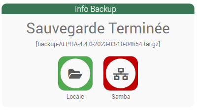
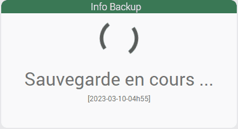
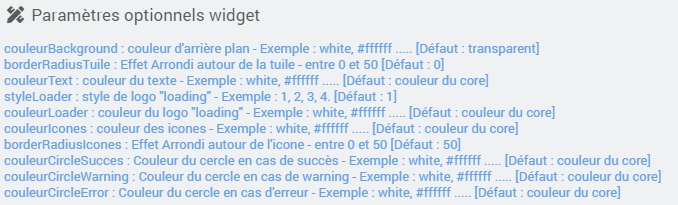
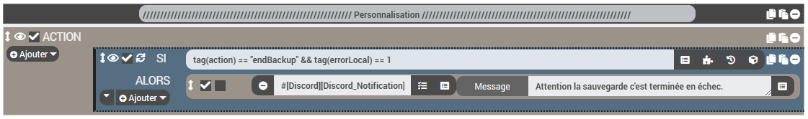

<a href="{{site.url}}/documentation">Accueil</a> --> <a href="{{site.url}}/documentation/{{site.widget}}">Widget</a> --> <a href="{{site.url}}/documentation/{{site.widget}}/fr_FR/widget_scenario">Widgets / Scénarios</a> --> Info backup

------------

# Widget [Info backup] 

- Informations disponibles sur le widget :
  - Etat de la sauvegarde local.
  - Etat de la sauvegarde samba (si activée).
  - Nom de la sauvegarde.

## 1) Télécharger la source

> - <a href="{{site.url_git}}/WIDGET_cmd.info.sting.info_backup" target="_blank">Télécharger les sources du Widget pour le Core V4</a>

### Version dashboard

- Déposer le fichier <b>cmd.info.string.Info_backup.html</b> dans le dossier <b>/html/data/customTemplates/dashboard/</b>

  

------------------------

## 2) Création d'un virtuel

- Ajoutez une commande Info/Autre, puis sauvegarder (1).
- Attention, ne pas historiser (2).
- Associez le widget à la commande Info/Autre,(3, 4 et 5).

## Paramètres optionnels

---------------------

## 3) Création du scénario

Créer un nouveau scénario puis ajouter un template :

- Selectionnez "Charger un template" puis ajoutez le fichier téléchargé précedemment (Info backup.json):

- Une fois chargé, celui-ci devrait apparaître dans le menu de gauche, cliquez dessus :

- Dans la nouvelle fenêtre :
  - Recherchez le virtuel créé précedemment (1).
  - Appliquez les modifications (2).
  - Demande de confirmation, cliquez sur OK puis sauvegardez le scénario.

> **Bug**
>
> Il est possible, après sauvegarde, que le scénario apparaisse vide, actualiser la page, pour faire apparaître le contenu.

## 4) Configuration
Une fois toutes ces étapes accomplies, ouvrez le scénario et modifiez, DANS LE BLOC CODE ,la taille mini de la sauvegarde en octet pour déclencher une erreur. [Défaut : 100Mo]

## 5) Options

Il est possible d'extraire plus d'informations du scénario, il faudra créer de nouvelles actions (event) dans celui-ci et ajouter des infos dans votre virtuel :

| Tag scénario | subType | Désignation | Valeurs |
| --- | --- | --- | --- |
| tag(action) | Autre| Etape de la sauvegarde| startBackup, endBackup |
| tag(errorScenario) | Binaire | Erreur dans le scenario | 0-->ok, 1-->erreur |
| tag(errorLog) | Binaire | Erreur dans le log | 0-->ok, 1-->erreur |
| tag(errorLocal) | Binaire | Etat backup local | 0-->ok, 1-->erreur |
| tag(errorSize) | Binaire | Erreur taille de la backup | 0-->ok, 1-->erreur |
| tag(errorSamba) | Binaire | Etat backup samba | 0-->ok, 1-->erreur, -1-->Désactivé |
| tag(errorMarket) | Binaire | Etat backup market | 0-->ok, 1-->erreur, -1-->Désactivé |

### Exemple dans le Scénario

### Changelog

<a href="./changelog">Changelog</a>

---------------------

## Aide
> - [Comment récupérer les sources ?]({{site.url}}/documentation/{{site.help}}/fr_FR/download)
> - [Comment ajouter des paramètres ?]({{site.url}}/documentation/{{site.help}}/fr_FR/application)

-------------------

<a href="{{site.url}}/documentation">Accueil</a> --> <a href="{{site.url}}/documentation/{{site.widget}}">Widget</a> --> <a href="{{site.url}}/documentation/{{site.widget}}/fr_FR/widget_scenario">Widgets / Scénarios</a> --> Info backup
