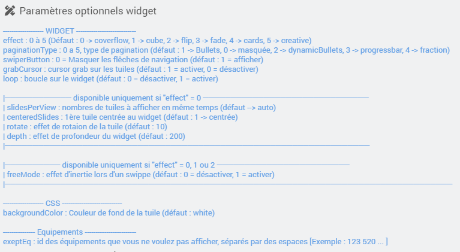

<a href="{{site.url}}/documentation">Accueil</a> --> <a href="{{site.url}}/documentation/{{site.widget}}">Widget</a> --> <a href="{{site.url}}/documentation/{{site.widget}}/fr_FR/widget_scenario">Widgets / Scénarios</a> --> Swiper Battery Jeedom

------------

# Widget [Swiper Battery Jeedom] 

## 1) Télécharger la source

> - [Télécharger les sources du Widget pour le Core V4]({{site.url_git}}/WIDGET_cmd.info.sting.swiper_battery_jeedom)

- Déposer le fichier <b>cmd.info.string.swiper_battery_jeedom.html</b> dans le dossier <b>/html/data/customTemplates/dashboard/</b>

  

- Déposer le dossier complet <b>cmd.info.string.swiper_battery_jeedom</b> dans le dossier <b>/html/data/customTemplates/dashboard/</b>

  
------------------------

## 2) Création d'un virtuel

- Ajoutez une commande Info/Autre, puis sauvegarder (1).
- Attention, ne pas historiser (2).
- Associez le widget à la commande Info/Autre,(3, 4 et 5).

## Paramètres optionnels

- Exemple de paramètres optionnels :

---------------------

## Aide
> - [Comment récupérer les sources ?]({{site.url}}/documentation/{{site.help}}/fr_FR/download)
> - [Comment ajouter des paramètres ?]({{site.url}}/documentation/{{site.help}}/fr_FR/application)

-------------------

<a href="{{site.url}}/documentation">Accueil</a> --> <a href="{{site.url}}/documentation/{{site.widget}}">Widget</a> --> <a href="{{site.url}}/documentation/{{site.widget}}/fr_FR/widget_scenario">Widgets / Scénarios</a> --> Swiper Battery Jeedom
